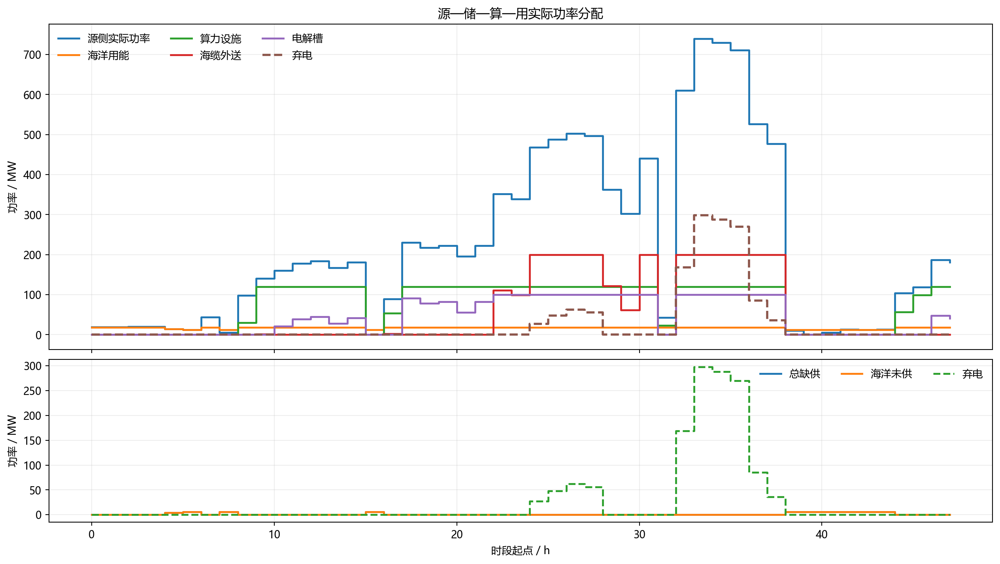

# 第5章典型场景验证与四方案对比准备

> 编制日期：2026-07-27  
> 当前模型：`V4整合/`  
> 结论等级：联合接口与4.5多时标机制已验证；E/H/C/M正式方案比较尚未完成  
> 未签认参数：**[假设值，待企业调研校准]**  
> 未核验公式：**[需查证文献支撑]**

## 1. 深远海能源枢纽框架对本项目的要求

NREL“Energy Clusters Offshore”把海上能源集群定义为大型可再生发电、储能、燃料生产和
淡化等互补用能的整体系统，并强调应比较不同配置、功能要求和优化目标。来源类型：
**国家实验室技术报告**。  
https://doi.org/10.2172/2483253

IEA介绍的海上hub-and-spoke框架强调海上集电、跨区电力连接以及Power-to-X的分阶段接入，
其价值来自互联和部门耦合，而不是单一设备效率。来源类型：**国际组织报告**。  
https://www.iea.org/articles/accelerating-deployment-of-large-scale-offshore-wind-power

NREL GreenHEART海上风电制氢框架把资源时序、风电系统、海淡、电解槽、压缩、储氢、
电力/氢运输和财务模型串联，再计算系统成本和LCOH。来源类型：**国家实验室技术报告**。  
https://www.nrel.gov/docs/fy25osti/91273.pdf

据此，第5章必须坚持：

1. 四种方案使用同一场址、同一风光潮时序和同一装机规模；
2. 使用相同初始状态、期末状态、可靠性要求、寿命和币值年；
3. 产品在各自交付测点计量，电力按海缆受端、氢按船运交付、算力按光缆交付；
4. 混合方案用系统净现值或等额年值比较，不能把LCOE、LCOH和算力单价直接相加；
5. 小时级能量分析与秒级稳定性分析分层进行。

## 2. 联合模型正确性分层结论

| 正确性层级 | 当前结论 | 说明 |
|---|---|---|
| 接口与单位 | 通过 | 冻结Schema、时间轴、单位、测点和请求—响应链已闭合 |
| 小时级功率守恒 | 通过 | 默认24 h最大残差1.038×10^-14 MW；48 h场景3.058×10^-13 MW |
| 损耗与收益去重 | 基本通过 | 4.6/4.7、4.5/4.7、4.4/4.7重复函数已旁路 |
| 状态跨期公平性 | 机制通过 | 默认储氢初值0；电池/储氢循环或最低期末硬约束只作用于末点，先放后充反例通过 |
| 联合入口场景可配置性 | 通过 | 已接受配置、源侧数据包、调度选项、算力模式和输出目录 |
| E/H/C/M方案开关 | 机制完成 | 资产开关已控制调度、CAPEX、FOM与替换成本；E/H/C仅完成开关冒烟测试，尚未形成正式排名 |
| 释放功率再调度 | 通过当前链路 | 4.6释放功率按海洋→海缆→同小时制氢→弃电分配；尚非全通道迭代优化 |
| 全通道行为场景 | 通过 | 48 h场景13项断言全部通过 |
| 年度经济正确性 | 部分完成 | 24 h/48 h已计CAPEX、FOM、融资、折旧、替换及分源成本；正式8760 h现金流仍未完成 |
| 碳减排正确性 | 未完成 | 只有项目排放代理，没有反事实基准 |
| 多时标储能机制 | 通过 | 4.5独立21项通过：秒—分钟REGFM_B1/黑启动降阶代理、8760 h库存和跨窗口继承 |
| 工程稳定性 | 未完成 | 尚无EMT/HIL、保护、多机并联、故障穿越和现场认证 |

因此，当前V4可作为“联合接口原型”“典型日能量流演示”和“4.5多时标机制验证模型”。
第5章E/H/C/M四方案的正式经济性、碳减排和工程稳定性排名仍未完成，不能由当前接口
测试目标直接推出。

### 2.1 已补齐的结果展示底稿

默认24 h与48 h全通道场景现已采用同一结果结构：

- `v4_kpi_summary.csv`：最终指标；
- `v4_economic_breakdown.csv`、`v4_environment_breakdown.csv`：经济和环境分项；
- `v4_hourly_detail.csv`：所有指标在完整仿真周期内的变化过程；
- `figures/final_kpi/`：最终值图；
- `figures/timeseries/`：源侧、储能、制氢储氢、算力、产品交付、再调度、弃电/缺供和母线残差全过程图。

该结构与E/H/C/M资产开关已经能支撑四方案使用相同字段出图；目前只完成开关及成本归零
冒烟测试，尚未用同一8760 h资源、统一初末状态完成正式比较，因此不得把24 h和48 h两个
机制场景当成四方案比较。

## 3. 正式方案比较的已修复项与剩余边界

### 3.1 初始状态透支已修复，四方案仍须统一跨期规则

默认24 h结果采用0 kg期初储氢，当期制氢38,743.072891 kg、损耗后交付38,355.642162 kg，
期末储氢回到0 kg；电池期初/期末SOC均为50%。4.8对其他场景中期初电池或储氢的
净消耗计入机会成本，避免形成零成本收益。4.9同时落实只作用于模拟末点的循环/最低期末
硬约束；独立反例证明周期中可以先放电、后回充，但不能在期末透支。

第5章四方案比较仍须为所有方案统一选用以下任一种规则：

- 循环期末：`SOC_end = SOC_initial`、`H2_end = H2_initial`；
- 年度最低期末：给定统一期末下限，并把库存增减按机会价值结算；
- 多年连续仿真：上一周期期末状态自然传递到下一周期。

### 3.2 算力可行域发布不一致

4.6已把在线条件最低功率统一为约2.394 MW并允许0 MW停机。算力默认是柔性负荷，只有
场景显式给出的`computeFirmRequestMW`才构成电气刚性边界。当前已聚合16个同构计算单元，
形成121.889280 MW设施容量和113.28 MW-IT物理容量，120 MW只是接口上限；算力CAPEX
按113.28 MW-IT计取。第5章方案比较前还应将同构静态聚合扩展为：

- 停机/在线离散状态；
- 在线最低设施功率；
- 最大设施功率；
- 队列与SLA形成的边际吸纳需求；
- 向上/向下调节能力。

### 3.3 已建立全生命周期代理账，但尚不是可融资模型

4.8已计入CAPEX、3年建设期融资、固定运维、折旧、资产替换和25年NPV。默认24 h目标
向量重算为`[9.23667×10^6 CNY, 217,565 kgCO2e, 5.4 MWh]`；初始CAPEX
263.655亿元、含建设期融资CAPEX 296.503亿元，含/不含惩罚成本NPV分别为
-359.888/107.826亿元。氢链即使无跨时库存，也按1 h额定产氢量配置1,761.494 kg
工艺缓冲罐；1 h为 **[假设值，待企业调研校准]**。潮流能造价、多项固定运维与替换比例仍为
**[假设值，待企业调研校准]**，且24 h按代表期重复年化。因此这些数值用于方案筛选，
不能解释为银行可融资NPV、税后IRR或正式回收期。

### 3.4 碳排放不等于碳减排

当前4.8计算的是项目排放代理值。碳减排必须相对反事实方案计算，并单独披露：

```text
避免排放 = 基准情景生命周期排放 - 项目情景生命周期排放
```

基准情景至少包括：

- 电力：受端边际电源或签认电网排放因子；
- 氢气：被替代的灰氢/现有氢供应链；
- 算力：被替代的陆上数据中心及其电力结构；
- 海洋用能：柴油机或现有海上供能方式。

GHG Protocol要求披露基准、边界、时期和数据来源，并将避免排放与产品自身排放分开报告。
来源类型：**行业标准组织指南**。  
https://ghgprotocol.org/estimating-and-reporting-avoided-emissions

氢气生命周期边界可参考DOE GREET的生产与供应链方法。来源类型：**政府官网/国家实验室模型**。  
https://www.energy.gov/cmei/greet

### 3.5 已有降阶动态代理，但小时级平衡仍不代表工程稳定性

NREL构网型逆变器路线图把频率控制、电压控制、系统保护、故障穿越与电压恢复、模型与
仿真列为独立验证主题。来源类型：**国家实验室技术报告**。  
https://www.nrel.gov/docs/fy21osti/73476.pdf

因此，4.4的小时级功率残差只能证明能量守恒。4.5现已用REGFM_B1结构建立秒—分钟级
正序降阶代理，覆盖频率—有功、电压—无功、正序限流、秒级SOC和黑启动带载顺序，并在
21项独立验收中通过相应机制检查。第5章“稳定性”仍需由独立动态层输出：

- 最大RoCoF；
- 频率最低点和稳态偏差；
- 最大/最小母线电压；
- 电压、频率恢复时间；
- 构网储能功率与能量裕度；
- 故障穿越成功率；
- 黑启动成功率及关键负荷恢复时间。

当前降阶代理可用于筛选工况和校核调度边界，但不能替代EMT/HIL、故障保护、多机并联与
现场认证。因此现阶段可以报告“降阶模型下的动态指标”，不能据此形成工程级
“电压频率稳定性”排名。

### 3.6 释放功率再调度已修正，但尚非统一优化

4.6实际功率低于请求时，释放功率现依次进入已申报海洋未供需求、海缆剩余送出能力、
同小时直通制氢，剩余才计弃电。默认24 h由此形成3,852.580 MWh海缆送端电量、
38,743.073 kg制氢和38,355.642 kg氢气交付，弃电2,718.985 MWh、EENS 5.4 MWh，
弃电与海洋/电气缺供并存时段为0。

当前再调度链尚未在算力响应后重新比较电池充电和电解槽，因此正式优化仍应反复分配，直到：

- 所有启用通道的向上调节能力耗尽；或
- 剩余功率小于所有设备的最小可运行块；或
- 受动态、安全或合同约束明确禁止继续分配。

### 3.7 氢储船运计量已拆分，航运优化和混合价值排序尚未建成

当前4.7桥接器已分别输出管输/船运提取量与损耗后交付量，4.8按通道分别计入运输成本。
48 h压力场景关闭管输并形成37,156.890926 kg船运氢交付，证明链路可用。但仍没有船期、
船舶库存、压缩/液化能耗及航次物流优化，因此还不是完整的“氢储船运”运营模型。

当前4.9先固定保障算力目标，再只比较氢气净边际价值与到岸电力价值。算力边际收益、
SLA机会成本、船运边际成本和库存影子价格没有进入同一价值排序。该规则可用于接口演示，
不能用于证明混合方案已经实现多产品价值最大化。

## 3.8 已完成的48小时全通道行为验证

`run_all_channel_validation_v4.m`采用800 MW风/光/潮装机（680/80/40 MW）及分阶段资源
倍率，依次制造新能源不足、出力上升、多通道启动、全通道饱和、新能源骤降和恢复。
全部容量与阶段倍率为 **[假设值，待企业调研校准]**。

| 验证量 | 48 h结果 | 数据状态 |
|---|---:|---|
| 源侧实际电量 | 10,674.427 MWh | [模型仿真结果] |
| 电池充/放电量 | 120.881/48.296 MWh | [模型仿真结果] |
| 算力设施用电 | 3,621.215 MWh | [模型仿真结果] |
| 海缆送端电量 | 2,596.032 MWh | [模型仿真结果] |
| 当期制氢量 | 37,915.194822 kg | [模型仿真结果] |
| 船运交付氢气 | 37,156.890926 kg | [模型仿真结果] |
| 弃电量 | 1,338.552 MWh | 仅在通道饱和阶段出现 |
| 海洋/电气缺供与弃电并存时段 | 0 | 一致性断言 |
| 最大母线残差 | 5.956×10^-14 MW | 小于冻结容差 |



> 图像状态：图5-1已于2026-07-26由`render_validation_figures.py`读取本轮
> `outputs/chapter5_all_channel_48h/v4_hourly_summary.csv`重生，并已完成目视核对。

该场景证明“全出口可激活”和“骤降时削减柔性算力、调用电池、停止弃电”的机制正确，
不证明800 MW是最优规模，也不替代E/H/C/M四方案经济比较。

## 4. 四种方案统一定义

| 方案 | 启用的高价值通道 | 保留的共同负荷 | 主要交付测点 |
|---|---|---|---|
| E：电力外输 | 海缆外送 | 公共辅助和必要海洋刚性负荷 | `MP-CABLE-RECEIVE` |
| H：氢储船运 | 电解槽、储氢、船运 | 公共辅助和必要海洋刚性负荷 | `MP-H2-DELIVERY` |
| C：算力外输 | 数据中心、光缆 | 公共辅助和必要海洋刚性负荷 | `MP-COMPUTE-DELIVERY` |
| M：混合方案 | 电力+氢气+算力 | 与前三方案完全相同 | 三个交付测点 |

“单一方案”只关闭其他高价值通道，不得删除共同辅助负荷、改变资源序列或放松可靠性约束。
若各方案允许不同资产规模，应分别报告：

- 等装机运行比较：源侧及转换设备容量固定，只比较调度；
- 各方案独立容量优化：在相同服务要求下分别优化CAPEX和运行；
- 预算约束比较：总投资相同，比较价值和可靠性。

三类比较不得混在同一张排名表中。

## 5. 典型场景矩阵

| 场景 | 建议时长 | 主要扰动 | 验证内容 |
|---|---:|---|---|
| S0典型资源日 | 24 h | 风光潮正常波动 | 基本能量流和产品分配 |
| S1高风高光富余 | 72 h | 源侧持续高出力 | 通道饱和顺序、弃电率、储能充满 |
| S2连续低风低光 | 168 h以上 | Dunkelflaute型低出力 | 长时氢储、EENS、SLA和库存约束 |
| S3快速爬坡 | 24 h+动态窗口 | 风电骤降、光伏日落 | 电池响应和算力柔性 |
| S4海缆受限/故障 | 72 h | 受端限电或海缆停运 | 氢气、算力替代外送能力 |
| S5数据中心/光缆故障 | 72 h | 算力通道降额 | 电力和制氢再分配 |
| S6电解槽/船运受限 | 168 h | 电解槽故障、船期窗口 | 储氢、库存溢出和弃电 |
| S7极端海况 | 168 h | 风光潮相关降额 | 多源互补和可靠性 |
| S8黑启动与故障穿越 | 秒—分钟 | 全停、短路、负荷阶跃 | 降阶代理筛选，工程结论需EMT/HIL |

S0—S7使用小时级调度模型；S8可先用当前REGFM_B1降阶代理筛选代表工况，正式工程结论
必须再用Simulink/EMT、HIL或经现场数据验证的动态模型确认。

## 6. 指标体系

### 6.1 经济性

- 项目NPV、IRR、动态回收期、等额年值；
- 总系统年化成本和净收益；
- 电力LCOE、氢气LCOH、储能LCOS；
- 算力每MWh-CS或每GPU·h贡献毛利；
- 海缆、船运、光缆和共享平台成本分摊敏感性；
- 电价、氢价、算力价格、碳价、贴现率和容量成本敏感性。

混合方案的主排序指标应使用系统NPV或等额年值；各产品平准化成本用于解释，不直接相加。

### 6.2 消纳与弃电

- 源侧可用电量；
- 实际发电量、弃电量和弃电率；
- 分通道吸纳电量；
- 电池充放电损耗、电解转化损耗、数据中心辅助电耗、海缆损耗；
- 边际增加1 MW通道容量带来的弃电下降量。

弃电率必须统一采用“弃电量/同一测点可用新能源电量”，不得用实际发电量作为不同方案
变化的分母。

### 6.3 碳减排

- 项目自身生命周期排放；
- 相对各产品基准的避免排放；
- 单位交付电力、氢气和算力服务碳强度；
- 共享资产排放分摊方法敏感性；
- 避免排放不得从项目自身碳足迹中直接扣除。

### 6.4 可靠性与稳定性

小时级可靠性：

- EENS、LOLP/LOLE；
- 海洋刚性负荷未供能；
- 算力刚性任务缺口、柔性任务延期和SLA罚金；
- 氢气合同缺供、船运延迟和库存越界次数。

动态稳定性：

- RoCoF、频率最低点、频率恢复时间；
- 电压偏差和恢复时间；
- 故障穿越、黑启动和关键负荷恢复；
- 储能构网功率/能量裕度。

## 7. 第5章实施顺序

### P0：正式比较前必须完成

1. ~~将联合入口改为接收场景配置~~：已支持`cfg/sourcePacket/dispatchOptions/computeMode/outputDir`；
2. ~~增加E/H/C/M四方案开关与共同约束模板~~：已完成资产开关和未启用资产成本归零；
3. ~~增加电池和储氢期末状态硬约束~~：已完成末点循环/最低规则及先放后充反例；
4. ~~建立4.6项目级同构多单元聚合~~：已完成；后续补异构单元、启停组合和动态可行域；
5. 将响应后再调度扩展为电池、算力、海缆、电解槽的迭代统一优化；
6. 增加氢气船期、船舶库存、压缩/液化能耗和航次成本；
7. 把电力、氢气和算力边际价值纳入同一优化目标；
8. ~~建立全通道行为场景~~：48 h场景已完成；继续增加168 h连续低出力与故障场景；
9. 补齐方案级CAPEX、固定运维、替换、残值和签认库存机会成本；
10. 建立碳减排反事实基准。

### P1：形成正式经济与消纳结论

1. 运行8760 h同源序列；
2. 先做等装机运行比较，再做独立容量优化；
3. 输出年度现金流、弃电率、通道利用率和可靠性；
4. 对价格、成本、距离、船期和资源年型进行敏感性分析。

### P2：形成稳定性结论

1. ~~建立构网型储能秒—分钟级降阶代理~~：REGFM_B1正序代理与黑启动顺序检查已完成；
2. 将典型小时工况映射到秒级故障、保护和多机并联场景；
3. 用EMT/HIL输出并校准频率、电压、故障穿越和黑启动指标；
4. 把经验证的动态可行边界回传4.9，而不是把动态方程塞入年度优化。

## 8. 可复跑就绪度审计

在`V4整合/`中运行：

```matlab
cd('chapter5_preparation')
report = run_chapter5_readiness_audit();
```

审计结果写入`chapter5_readiness_report.csv`。其中：

- `PASS`表示当前结果具备对应基础；
- `NOT_READY`表示代码已有相关量，但当前状态或参数不满足公平比较；
- `BLOCKED`表示当前模型没有对应输入、基准或动态结果。

该审计不替代4.1—4.9全量验收；全量验收回答“联合接口是否正确”，本审计回答
“是否已经可以写第5章正式对比结论”。
