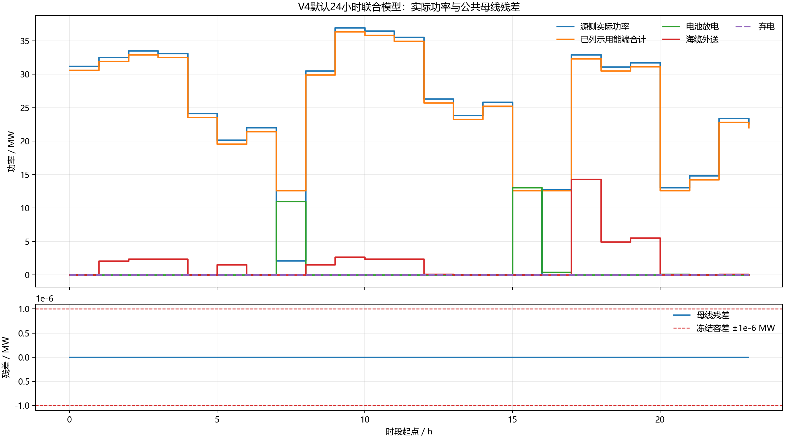

# 4.4 公共母线功率平衡：V4现行说明

## 责任与公式

4.4是V4唯一公共母线实际功率总账，只读取4.3、4.5、4.6、4.7提交的`actual`量：

```text
r = pSourceActual + pBessDischargeActual + pGridImportActual
  - pBessChargeActual - pElectrolyzerActual - pDCFacilityActual
  - pExportSendActual - pMarineActual - pSourceAux
  - pCommonAux - pPostPOILoss - pSpillActual
```

缺供是可靠性KPI，不作为虚拟功率注入。电池效率由4.5在SOC方程中处理；电解槽SEC、水耗和储氢损失由4.5处理；PUE由4.6处理；海缆损耗由4.7处理。4.4不得重复扣减。

## 当前24小时联合结果

以下结果由2026-07-26重新运行`run_v4_integration`后生成的
`outputs/v4_hourly_summary.csv`直接汇总：

| 指标 | 当前结果 | 说明 |
|---|---:|---|
| 源侧实际电量 | 596.879 MWh | 4.3在MP-03提交的actual |
| 电力外送量 | 42.323 MWh | 4.6响应后的释放功率继续进入海洋、海缆或同小时直通制氢 |
| 实际弃电量 | 2.726×10^-14 MWh | 数值舍入量，按0 MWh解释 |
| 海洋未供能 | 25.354 MWh | 4.7可靠性KPI，不进入平衡式 |
| 最大母线残差 | 1.038×10^-14 MW | 小于1×10^-6 MW冻结容差 |
| 当前制氢量/交付量 | 570.221/564.519 kg | 从0 kg期初库存开始，期末库存回到0 kg |



**图4-4-1 V4公共母线逐时实际量与残差。** 图中序列直接读取
`v4_hourly_summary.csv`；上图比较源侧actual、已列示用能端、电池放电、海缆外送和弃电，
下图放大显示逐时残差及冻结容差。

默认场景中不存在`spillMW>0`与海洋/电气缺供同时发生的时段。电解槽采用5×20 MW模块、
单模块4 MW最低功率的独立启停假设，24小时已形成非零产氢；该启停方式属于
**[假设值，待OEM/BOP确认]**。48小时扩容压力场景进一步覆盖电解槽满功率、全出口饱和
和新能源骤降。

## 适用限制

本结果只证明24小时接口联调闭合。容量、效率、价格、负荷和初态仍包含公开参考值与
**[假设值，待企业调研校准]**，不得解释为工程经济、构网动态或最优容量结论。
