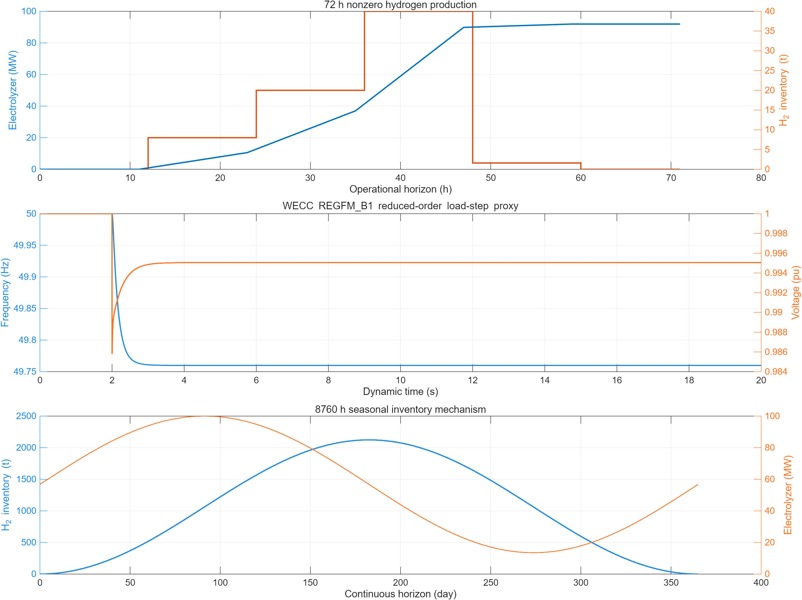

# 4.5公开数据替代、多时标模型与接口审查（2026-07-26）

## 1. 结论

4.5已由单一1 h响应原型扩展为三个可独立复算的层级：

1. 小时级BESS—模块化电解槽—储氢物理核心；
2. 秒级NREL/WECC REGFM_B1正序降阶构网代理与黑启动顺序检查；
3. 连续8760 h储氢库存模型和跨窗口状态继承检查。

联合模型已新增4.5 BOUNDARY。4.9不再从公共配置重置SOC、储氢或电解槽启停/FLEH，而是读取4.5显式期初状态；电池循环/最低期末规则、储氢循环/最低期末规则和构网备用已进入硬校验。循环或最低期末目标只约束窗口末点，窗口内路径仅守物理下限与构网备用下限。默认24 h案例从0 kg储氢开始，当前制氢570.221 kg、交付564.519 kg，期末BESS为20 MWh、储氢为0 kg。

仍不能据此声称“构网/黑启动已经工程认证”或“2,123 t就是推荐储氢容量”。动态模型是正序降阶代理；季节场景是 **[假设值，仅用于机制测试]**。

## 2. 本轮纠正的关键口径

### 2.1 电解槽最低功率

Nel MC4000是20 MW/套，厂商给出的20%—100%调节范围对应单套4—20 MW，而不是天然对应100 MW全站20—100 MW。

若5套可独立启停：

\[
n_t\in\{0,1,\ldots,5\},\qquad
4n_t\le P_t^{EL}\le20n_t .
\]

若5套必须同步启停，才可继续使用：

\[
20u_t\le P_t^{EL}\le100u_t .
\]

当前V4采用“模块可独立启停”机制场景，因此默认联合调度最低功率由20 MW降为4 MW；共享BOP、整流配置和控制权限尚未取得OEM确认，必须标记 **[假设值，待OEM/BOP确认]**。

来源类型：**企业官方网站/厂商规格**，[Nel MC Series Modular Plants Rev A](https://nelhydrogen.com/wp-content/uploads/2025/10/MC-Series-Modular-Plants-PD-0600-0145-Rev-A-1.pdf)。

### 2.2 SEC和电气边界

56.77 kWh/kg是Nel在100%负荷下的系统能耗，氢产品出口为30 barg。它不能证明已经包含：

- 原海水预处理；
- 30 barg以上压缩；
- 液化；
- 储罐调压；
- 船舶装载。

V4现将边界写为：

```text
AC设施输入 → 30 barg氢产品
```

海水预处理、更高压力压缩、液化和船舶装载应另设负荷/成本，不得含糊地重复计入4.4。厂商没有公开完整部分负荷SEC曲线；把56.77用于4%—100%功率区间仍为 **[假设值，待OEM部分负荷曲线校准]**。

DOE给出的PEM系统55 kWh/kg（2022状态）和57.5 kWh/kg寿命期平均值只用于交叉核验或敏感性，不能替代Nel具体设备参数。

来源类型：**政府官网**，[U.S. DOE PEM技术目标](https://www.energy.gov/cmei/fuels/technical-targets-proton-exchange-membrane-electrolysis)；**政府/国家实验室项目记录**，DOE Program Record 24005。

### 2.3 储氢容量

现有72,000 kg储氢容量按当前配置仅相当于：

- 1,000 kg/h提氢需求下72 h；
- 100 MW、SEC 56.77 kWh/kg满负荷产氢约40.87 h。

因此72 t只能作为日内—多日库存机制场景，不能证明跨周或跨季节。

## 3. 公开来源与当前参数

| 参数/公式 | 当前用法 | 来源类型 | 证据状态 |
|---|---:|---|---|
| 单套MC4000容量 | 20 MW | 企业官方网站/厂商规格 | 厂商公开值 |
| 单套最低功率 | 4 MW | 企业官方网站/厂商规格 | 20%×20 MW推导值 |
| 5套独立启停 | 是 | 项目机制假设 | **[假设值，待OEM/BOP确认]** |
| 系统SEC | 56.77 kWh/kg | 企业官方网站/厂商规格 | 仅100%负荷、30 barg边界 |
| 饮用水需求 | 15.9 L/kg H₂ | 企业官方网站/厂商规格 | 不等于原海水取水量 |
| 待机启动 | <8 min | 企业官方网站/厂商规格 | 小时层只记录启动事件 |
| 爬坡能力 | ≤7.4%额定功率/s | 企业官方网站/厂商规格 | 保存为能力；未强行写入小时层 |
| BESS状态方程/循环状态 | 指数保持形式 | GitHub官方开源仓库/官方文档 | PyPSA结构证据 |
| 储氢状态方程/循环状态 | 指数保持形式 | GitHub官方开源仓库/官方文档 | PyPSA结构证据 |
| GFM有功—频率结构 | REGFM_B1 | 国家实验室/WECC官方技术报告 | 公式来源 |
| GFM正序限流 | REGFM_A1相量限流边界 | 国家实验室/WECC官方技术报告 | 公式来源 |
| 绿色氢市场情景价 | 28.36 CNY/kg | 数据网站（上海环境能源交易所） | 情景锚点，非合同价 |
| 广东日前电价情景 | 347 CNY/MWh | 政府官网（国家能源局） | 年度情景锚点 |
| BESS 20 MW/40 MWh | 当前接口案例 | 项目设定 | **[假设值，待企业调研校准]** |
| 构网备用5 MW/1 MWh | 当前接口案例 | 项目设定 | **[假设值，待PCS厂商校准]** |
| 黑启动SOC门槛30% | 当前接口案例 | 项目设定 | **[假设值，待PCS及辅机研究校准]** |
| 储氢损失率0 | 理想无损基准 | 项目设定 | **[假设值，待储氢路线校准]** |

主要开源和官方来源：

- **GitHub官方开源仓库**：[PyPSA storage constraints（固定提交）](https://github.com/PyPSA/PyPSA/blob/c2e6801e6f4fee78adfcc399b2ec688d0058eecf/docs/user-guide/optimization/storage.md)；
- **国家实验室/WECC官方技术报告**：[NREL/WECC REGFM_B1](https://www.osti.gov/biblio/2376832)；
- **国家实验室/WECC官方技术报告**：[PNNL REGFM_A1](https://www.pnnl.gov/main/publications/external/technical_reports/PNNL-35110.pdf)；
- **国家实验室论文**：[Sandia BESS状态递推](https://www.osti.gov/servlets/purl/1482478)；
- **国家实验室规范**：[UNIFI Specifications V3](https://docs.nlr.gov/docs/fy26osti/98381.pdf)；
- **数据网站**：[上海环境能源交易所绿色氢能价格指数](https://overview.cneeex.com/c/2025-06-09/496358.shtml)；
- **政府官网**：[国家能源局《2024年度中国电力市场发展报告》](https://www.nea.gov.cn/20250717/54ae0fdb11f04b39a5b670999c04ef81/2025071754ae0fdb11f04b39a5b670999c04ef81_19fe782a11f3aa40209907a80e3e692150.pdf)。

## 4. 正式物理核心

### 4.1 BESS

\[
E_t=(1-\lambda_B)^{\Delta t}E_{t-1}
+\eta_{ch}P_{ch,t}\Delta t
-\frac{P_{dis,t}\Delta t}{\eta_{dis}} .
\]

\[
E_t^{min}+E^{GFM,res}\le E_t\le E_t^{max},
\qquad
P_{dis,t}\le P_{dis}^{max}-P^{GFM,res}.
\]

状态保持指数形式来自PyPSA官方文档；当前自放电率、5 MW构网备用功率和1 MWh备用能量是 **[假设值，待PCS厂商校准]**。上式是逐时物理可行域，不把循环/最低“期末目标”提升为每个时步都必须满足的库存下限。

### 4.2 产氢与储氢

\[
m_t^{prod}=\frac{1000P_t^{EL}\Delta t}{SEC_t}.
\]

\[
H_t=(1-\lambda_H)^{\Delta t}H_{t-1}
+m_t^{prod}-m_t^{withdraw}.
\]

同一时段提氢可以为当期产氢腾出流通空间，因此罐容约束施加在时末库存；代码同时输出`h2DirectFlowThroughKg`，不再先以“零提氢”错误裁剪电解槽，再用第二遍提氢补算。算力实际功率低于计划时，4.9后校正可把同小时释放功率直接转给电解槽并形成直通氢流，不必等待下一小时，也不改变已经承诺的期末库存。

逐时质量残差：

\[
r_t^H=H_t-(1-\lambda_H)^{\Delta t}H_{t-1}
-m_t^{prod}+m_t^{withdraw}.
\]

### 4.3 期末硬约束

年度可比场景使用：

\[
E_T=E_0,\qquad H_T=H_0.
\]

检修/安全储备场景可使用：

\[
E_T\ge E^{target},\qquad H_T\ge H^{target}.
\]

`free_with_terminal_value`只可用于滚动优化，并必须设置终端价值。期初库存机会成本不能替代上述硬约束。`cyclic`和`minimum`目标只在\(t=T\)检查；\(0<t<T\)仅执行SOC、罐容、质量守恒和构网备用等物理边界，允许先放后充或先提后补。

## 5. 秒级构网层

秒级模型采用NREL/WECC REGFM_B1公开结构：

\[
T_p\dot p_d+p_d=\frac{\omega_{ref}-\omega_m}{m_p},
\qquad p_{cmd}=p_{ref}+p_d,
\]

\[
T_{Pf}\dot p_f=p-p_f,
\]

\[
2H\dot{\Delta\omega}_m
=p_{cmd}-p_f-D_1\Delta\omega_m
-D_2(\Delta\omega_m-z_D),
\]

\[
\dot z_D=\omega_D(\Delta\omega_m-z_D),
\qquad \dot\delta=\omega_0\Delta\omega_m.
\]

Q–V采用REGFM_B1的滤波、下垂和PI结构；正序电流按PNNL/WECC边界裁剪；实际有功按秒积分进入BESS能量。2026-07-26实跑的21项独立断言全部通过，其中：

- 72 h机制场景从0 kg开始制氢36,779.989 kg；
- 15 MW基态加5 MW备用的负荷阶跃，频率最低点49.7599 Hz、端口最大电流1.0 pu、BESS能量变化−0.114092 MWh；
- 120 s持续支撑调用2 MW/0.064444 MWh，频率最低点49.9021 Hz，未超过发布的5 MW/1 MWh备用；
- 过载限流场景必须返回`feasible=false`，避免把电流受限后的降额供电误判为负荷已满足；
- 黑启动顺序代理在7.38 s建立端口电压/频率，10 s后才带载。

上述5 MW/1 MWh备用、REGFM控制参数和场景扰动均为 **[假设值，待PCS厂商校准]**；数值只证明模型按设定边界运行。

UNIFI V3把黑启动列为应用特定的Tier 4能力，没有统一通用合格试验。当前模型只检查：

- 无外部电压/频率参考时建立端口参考；
- SOC和功率/电流裕度；
- 建立电压频率后再分级带载；
- 秒级有功真实进入SOC。

变压器涌流、谐波、三相不平衡、短路故障、保护配合和多机并联必须后续用EMT、HIL或现场试验，当前均为 **[未验证]**。

## 6. 连续8760 h机制验收

机制场景采用：

\[
P_t^{avail}=56.77+43.23\sin\left(\frac{2\pi t}{8760}\right)\ {\rm MW},
\]

配合1,000 kg/h恒定提氢、零初始库存和零损失。该序列是 **[假设值，仅用于机制测试]**，不是场址资源数据。

| 指标 | 2.2×10⁶ kg机制罐 | 72,000 kg现有案例 |
|---|---:|---:|
| 连续时域 | 8,760 h | 8,760 h |
| 年产氢 | 8,760.000 t | 受罐容裁剪 |
| 峰值库存 | 2,123.345 t | 72.000 t |
| 连续释放 | 4,378 h | 库存提前耗尽 |
| 未交付 | 约0 kg | 2,051.345 t |
| 年末循环 | 通过 | 交付失败 |



**图4-5-7 三时标独立验收。** 上、中、下三幅分别读取
`4_5_operational_72h.csv`、`4_5_gfm_step_seconds.csv`和
`4_5_seasonal_8760h.csv`；图片由同一验证入口生成。

12个连续730 h块与一次8760 h计算的库存、产氢最大差均为0；若每块错误重置为配置初值，则不会得到该结果。

机制罐容量不是工程推荐值。正式季节方案必须替换为4.3连续8760 h场址序列，并明确高压气态、液氢、地下储库或其他载氢介质后，重新校准损失、安全、CAPEX、压缩/液化能耗和船期。

## 7. 联合接口判断

### 4.4

不改公共母线公式。4.4只读取4.5最终`actualMW`。当前SEC只覆盖交流设施入口至30 barg产品；一旦增加海水预处理、高压压缩或液化，必须经4.2明确端口后再进入4.4，不能藏入同一电解槽功率。

### 4.7

4.7只负责管输/船运提取和交付损耗。联合入口直接使用4.9按4.5库存递推得到的逐时提氢计划；若4.7实际提取与计划不一致，运行返回接口不可行，不再用“零提氢第一遍＋实际提氢第二遍”静默修正。

### 4.8

继续按实际产氢、启动次数、BESS放电、渠道提取和最终交付评价。4.8已按公开代理计入BESS、电解槽和陆上储氢CAPEX、固定运维、融资、折旧及替换；储氢技术路线、海上安装、压缩/液化、船期和航次成本仍没有项目报价，因此当前NPV只用于方案筛选，仍不能输出正式项目LCOH、税后IRR或回收期结论。

### 4.9

4.9必须接收4.5 BOUNDARY，不能自行从`cfg`重置状态。当前已经执行：

- 显式期初SOC/储氢以及电解槽启停、上一步功率和FLEH继承；
- BESS构网备用功率/能量；
- 电池循环或最低期末硬约束，仅在窗口末点施加；
- 储氢循环或最低期末硬约束，仅在窗口末点施加；
- 4 MW单模块最低功率；
- 逐时制氢—提氢—库存一致性；
- 算力释放功率同小时再分配至制氢、外送或弃电，并保持功率/氢量闭合。

当前仍是确定性可行规则，不是混合整数全局最优。最小开停时间、部分负荷SEC曲线、船期和容量—运行联合优化尚未实现。
