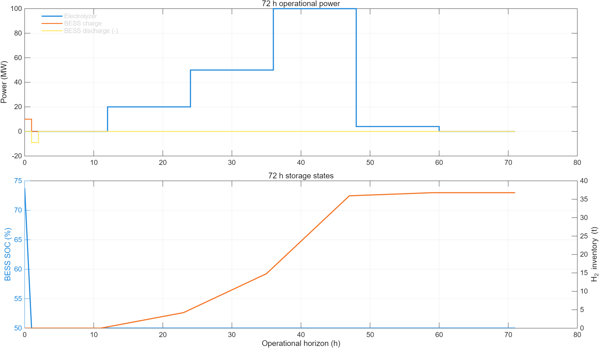
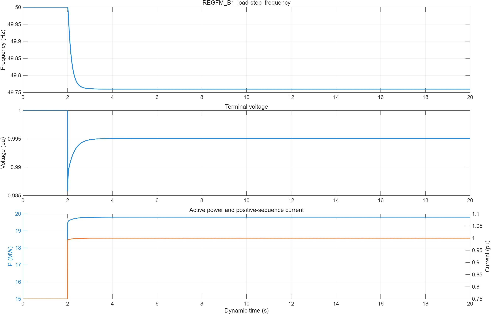
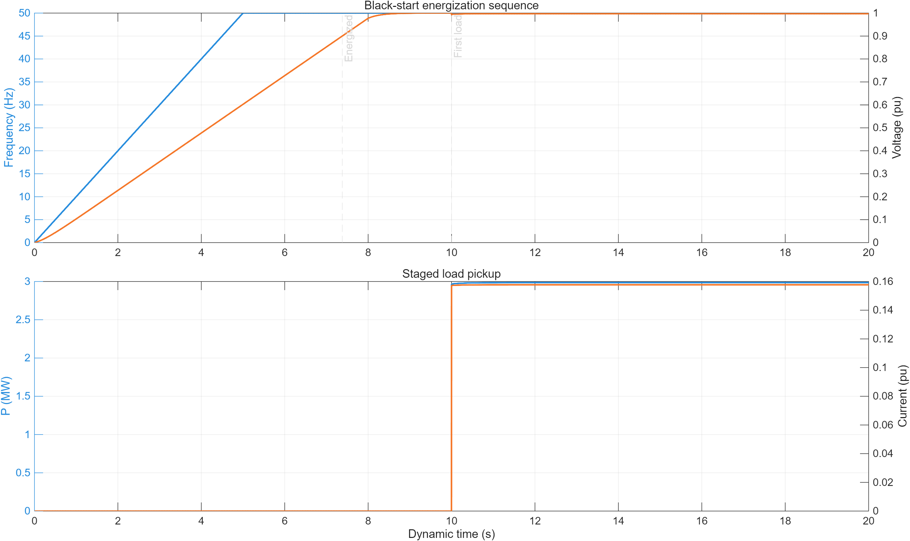
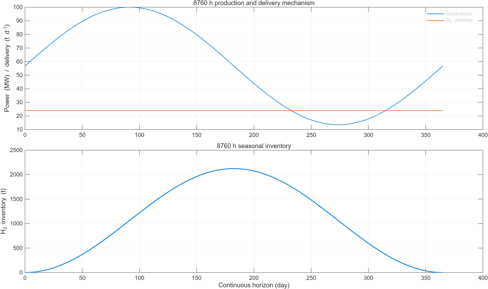

# 4.5多时标接口语义增补（V4）

本文件是`BLUE_HUB_CH4_SCHEMA_V2`的实现说明，不修改4.2冻结公共功率端口、测点、单位、阶段顺序或所有权。

## 1. 保持不变的冻结端口

- `bessCharge`：公共母线非负消耗；
- `bessDischarge`：公共母线非负注入；
- `electrolyzer`：`MP-ELECTROLYZER`非负交流功率；
- 所有端口继续保留`requested/accepted/actual`。

秒级REGFM_B1和8760 h库存模型属于4.5内部验收域，不新增第二套公共母线功率平衡。

## 2. BOUNDARY可选状态/诊断字段

| 字段 | 单位 | 含义 | 证据状态 |
|---|---:|---|---|
| `state.gfmReservePowerMW` | MW | 小时调度不可占用的快速有功备用 | **[假设值，待PCS厂商校准]** |
| `state.gfmReserveEnergyMWh` | MWh | 为秒级动态服务保留的能量 | **[假设值，待PCS厂商校准]** |
| `state.blackStartAvailable` | boolean | SOC、备用功率和备用能量满足代理门槛 | 仅降阶行为代理 |
| `state.bessEnergyMWh`首值 | MWh | 4.9显式继承的窗口期初状态 | 4.5提交状态 |
| `state.h2InventoryKg`首值 | kg | 4.9显式继承的窗口期初状态 | 4.5提交状态 |
| `state.electrolyzerOn`首值 | boolean | 电解槽上一窗口末启停状态 | 4.5提交状态 |
| `state.electrolyzerPowerMW`首值 | MW | 电解槽上一窗口末功率 | 4.5提交状态 |
| `state.electrolyzerFLEH`首值 | h | 累计等效满负荷小时 | 4.5提交状态 |

当前运行期overlay发布5 MW/1 MWh构网备用，属于 **[假设值，待PCS厂商校准]**。BOUNDARY还通过`service`发布电解槽额定功率、模块数量、单模块额定/最低功率、独立启停标志，以及BESS/储氢终端规则与终端目标；模块独立启停为 **[假设值，待OEM/BOP确认]**。

## 3. RESPONSE可选状态/诊断字段

| 字段 | 单位 | 含义 |
|---|---:|---|
| `state.terminalConstraintOK` | boolean | BESS和储氢期末规则均满足 |
| `state.bessTerminalResidualMWh` | MWh | 期末能量减目标 |
| `state.h2TerminalResidualKg` | kg | 期末库存减目标 |
| `service.electrolyzerOnlineModules` | count | 在线20 MW模块数 |
| `service.h2MassBalanceResidualKg` | kg/step | 氢质量递推残差 |
| `service.bessEnergyBalanceResidualMWh` | MWh/step | BESS能量递推残差 |

这些字段用于4.9硬校验、4.8审计或测试，不改变冻结公共端口含义。`finalState`至少返回BESS能量、储氢库存、电解槽启停、末时步功率和累计FLEH，供下一滚动窗口原样继承。

## 4. 参数扩展

`v4_apply_4_5_parameter_overlay.m`在运行期增加模块内部参数：

- 模块数量、单模块额定/最低功率和独立启停假设；
- BESS自放电、构网备用、黑启动SOC门槛；
- BESS/储氢期末目标；
- SEC适用边界。

该overlay不修改`cfg.interface.*`或Schema版本。未验证值均在4.5参数审查中标为 **[假设值，待企业/PCS/OEM调研校准]**。

## 5. 状态继承规则

4.9缺少4.5 BOUNDARY时必须报错，不能回退到`cfg`初值。`cyclic`规则以本窗口显式期初状态为期末目标；`minimum`规则使用配置目标。两类目标只在窗口末点施加，窗口内路径只守SOC/罐容等物理下限以及已发布的构网备用下限，允许先放后充或先提后补。上一窗口的`finalState`应作为下一窗口的`state0`，其中电解槽启停、末功率和FLEH不能被重置。

## 6. 算力释放后的同小时再分配

4.6返回的实际算力功率低于4.9计划值时，差额仍属于同一小时公共母线的可用功率。当前4.9后校正顺序为“补足海洋用能缺口→利用海缆余量→在4.5模块可行域内增加电解槽功率并形成同小时产氢/直通提氢→剩余功率记为弃电”。该流程不新增第二个功率端口，也不绕过4.5质量守恒和期末约束。

## 7. 多时标全过程图

72 h运行、秒级构网阶跃、黑启动和8760 h季节储氢分别成图，避免把不同横轴和不同物理
含义压在同一张图中。

上述图片均由`run_4_5_standalone_validation.m`当前结果生成；参数证据状态与本文件前述
声明一致，不能解释为工程认证曲线。
