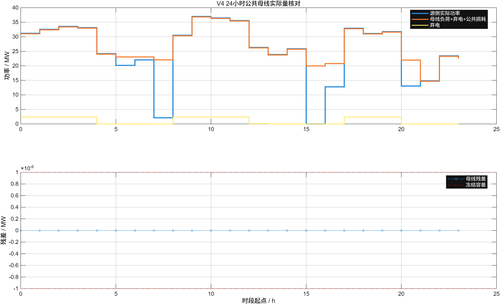

# 4.4 公共母线功率平衡：V4现行说明

## 责任与公式

4.4是V4唯一公共母线实际功率总账，只读取4.3、4.5、4.6、4.7提交的`actual`量：

```text
r = pSourceActual + pBessDischargeActual + pGridImportActual
  - pBessChargeActual - pElectrolyzerActual - pDCFacilityActual
  - pExportSendActual - pMarineActual - pSourceAux
  - pCommonAux - pPostPOILoss - pSpillActual
```

缺供是可靠性KPI，不作为虚拟功率注入。电池效率由4.5在SOC方程中处理；电解槽SEC、水耗和储氢损失由4.5处理；PUE由4.6处理；海缆损耗由4.7处理。4.4不得重复扣减。

## 当前24小时联合结果

以下结果由2026-07-25重新运行`run_v4_integration`后生成的
`outputs/v4_hourly_summary.csv`直接汇总：

| 指标 | 当前结果 | 说明 |
|---|---:|---|
| 源侧实际电量 | 596.879 MWh | 4.3在MP-03提交的actual |
| 实际弃电量 | 26.310 MWh | 4.9确认、4.4记账 |
| 海洋未供能 | 48.103 MWh | 4.7可靠性KPI，不进入平衡式 |
| 最大母线残差 | 4.591×10^-14 MW | 小于1×10^-6 MW冻结容差 |
| 当前制氢量 | 0 kg | interface_smoke调度结果，不代表工程方案不制氢 |



**图4-4-1 V4公共母线逐时实际量与残差。** 图中序列直接读取
`v4_hourly_summary.csv`；上图比较源侧actual与负荷、弃电和公共损耗账，
下图放大显示逐时残差及冻结容差。

## 适用限制

本结果只证明24小时接口联调闭合。容量、效率、价格、负荷和初态仍包含公开参考值与
**[假设值，待企业调研校准]**，不得解释为工程经济、构网动态或最优容量结论。
