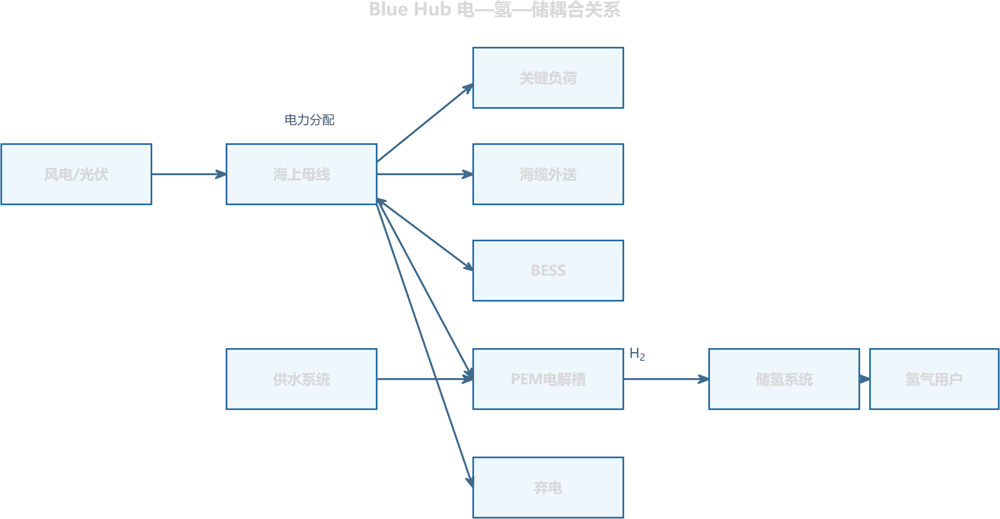
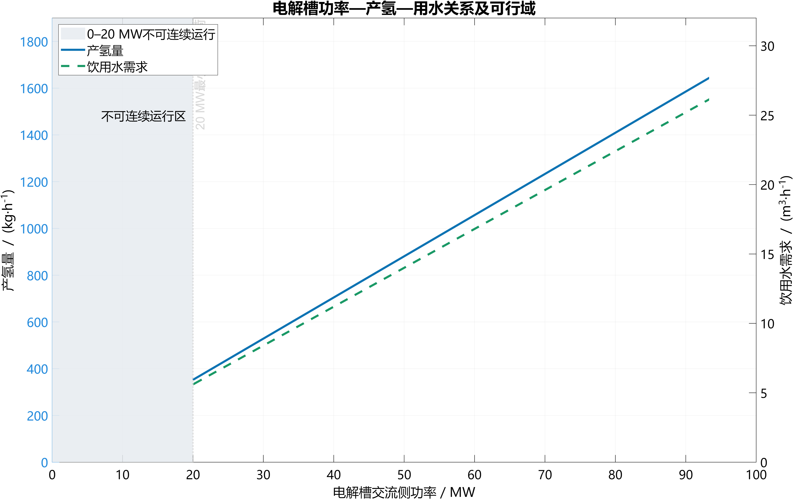
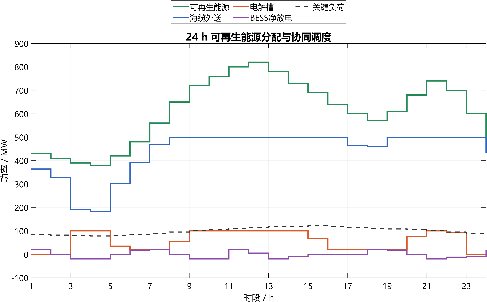
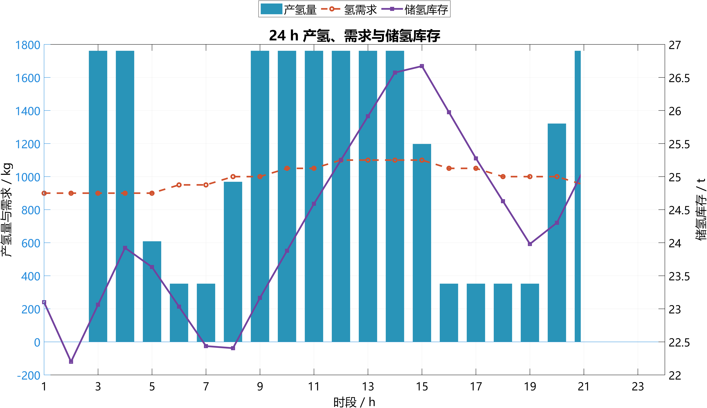
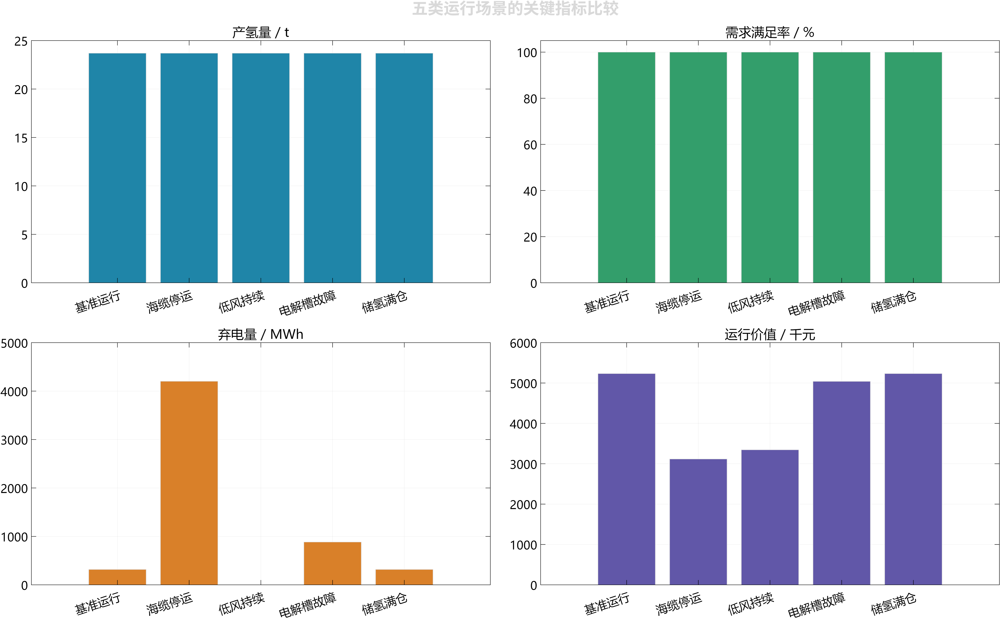
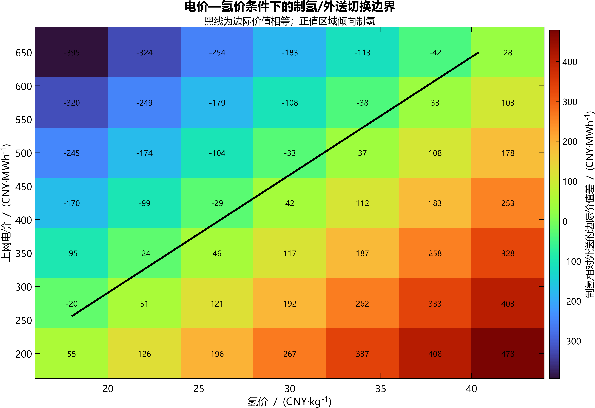

<!-- 公式采用 LaTeX；图片和可复算CSV由reference_model/blue_hub_demo_and_figures.m写入assets。 -->

# Blue Hub 电解制氢系统核心模型

*可再生能源消纳、储氢与协同调度的数学建模*

## 1 研究依据与现实问题

### 1.1 文献查阅与建模依据

古早背景仅供参考，查阅了电解水制氢、PEM电解槽动态运行和可再生能源制氢经济性方面的代表性论文。三个问题：电解槽能否跟随波动功率运行，哪些设备约束必须写进模型，以及什么条件下应当优先制氢而不是外送电力。

Ursúa等对水电解技术的性能、效率和应用进行了系统梳理[1]；Carmo等进一步总结了PEM水电解的材料、结构和工程瓶颈[2]。在能源系统层面，Buttler和Spliethoff指出，负荷范围、爬坡、启动时间和部分负荷特性是评价电解槽调节能力的关键参数[3]。Glenk和Reichelstein则从投资与实时调度角度说明，可再生出力和电价波动会直接改变制氢装置的最优容量与运行时段[4]。据此，本文把“设备可行域—电氢守恒—跨时段价值比较”作为建模主线。

| 文献 | 主要认识 | 对本模型的具体作用 |
| --- | --- | --- |
| Ursúa et al., 2012[1] | 水电解技术适合与可再生能源结合，但效率和运行范围必须按技术路线区分。 | 采用PEM设备参数，不混用不同技术路线的效率。 |
| Carmo et al., 2013[2] | PEM具有较高电流密度和动态响应能力，同时受材料、寿命和成本约束。 | 保留启停、寿命与系统能耗口径，不只计算理论反应电量。 |
| Buttler & Spliethoff, 2018[3] | 部分负荷、爬坡和启动性能决定电解槽参与储能与电网平衡的能力。 | 建立0或20%–100%额定功率、启停和爬坡约束。 |
| Glenk & Reichelstein, 2019[4] | 实时电价和间歇性出力共同影响可再生电力制氢的经济性。 | 比较制氢与外送的边际价值，并开展电价—氢价敏感性分析。 |

注：上表只提取与本模型直接相关的结论；论文题录、DOI及可截图网页见第8节。

### 1.2 现实背景与研究目标

国家能源局披露，截至2026年3月底，全国建成和在建可再生能源制氢产能已超过100万吨/年，其中建成投运超过25万吨/年，电解水是主要技术路线[5]。国家发展改革委、国家能源局发布的《氢能产业发展中长期规划（2021—2035年）》也提出探索“风光发电+氢储能”一体化应用[6]。这些信息说明，制氢模型已经不能停留在“装机容量×运行小时”的静态估算上。

研究对象为由5套20 MW Nel MC4000模块聚合而成的100 MW PEM电解制氢系统。给定逐时可再生能源出力、关键负荷、电价、氢需求、设备可用状态和储能初值，模型决定电解槽功率、储氢充放、BESS（Battery Energy Storage System，电池储能系统，用于短时储存电能、平滑功率波动并进行峰谷价差调节）充放电及海缆外送功率，在满足电力和氢气守恒的条件下提高综合运行收益。

> 建模主线  输入时序 → 电解槽可行功率 → 产氢与用水 → 储氢/BESS状态更新 → 母线功率平衡 → 跨时段优化与验证。

## 2 模型边界、假设与符号

### 2.1 系统边界

模型使用电解槽系统交流侧功率。Nel规格中的56.77 kWh/kg为系统比能耗，已经覆盖电堆、整流及常规系统辅助用电[7]。因此，母线平衡只计一次电解槽功率。若项目还需将海水处理为饮用水，或将30 barg氢气压缩至更高压力，则把淡化和进一步压缩列为系统边界外的独立负荷。

| 层级 | 纳入模型的内容 | 处理方式 |
| --- | --- | --- |
| 电解槽 | 交流侧用电、最小负荷、启停、爬坡、产氢、饮用水需求 | 设备约束与产氢方程 |
| 储氢 | 库存、损耗、销售/管输、放散和缺供 | 逐时质量守恒 |
| 电力系统 | 可再生能源、关键负荷、BESS、海缆外送和弃电 | 统一母线功率平衡 |
| 调度 | 电解槽功率、储能动作和外送计划 | 混合整数线性优化 |
| 暂不展开 | 电化学极化、温度场、管网瞬态和控制器毫秒级动作 | 需要高频数据时另建子模型 |

**图1  Blue Hub电—氢—储耦合关系（matlab）**

### 2.2 基本假设

| 编号 | 假设 | 说明 |
| --- | --- | --- |
| A1 | 时间离散 | 基础时步为1 h；若研究调频或启动过程，应缩短至分钟或秒级。 |
| A2 | 系统比能耗 | 允许负荷区间内采用固定SEC；厂商未公开完整部分负荷效率曲线。 |
| A3 | 氢气计量 | 产氢、销售和燃料电池耗氢均以kg/时步计，需求和管输能力以kg/h输入。 |
| A4 | 设备可用性 | 可用状态aₜ为0或1；计划检修和故障由外部场景给定。 |
| A5 | 安全边界 | 模型不允许低于最小连续负荷运行；安全联锁由本地控制系统执行。 |

### 2.3 主要符号

| 符号 | 单位 | 含义 | 类型 |
| --- | --- | --- | --- |
| Pᵉˡₜ | MW | 电解槽实际交流侧功率 | 决策变量 |
| uₜ | 0/1 | 电解槽开机状态 | 决策变量 |
| aₜ | 0/1 | 电解槽可用状态 | 场景输入 |
| mᴴ²ₜ | kg/step | 时步t的产氢量 | 派生变量 |
| Hₜ | kg | 时步末储氢库存 | 状态变量 |
| Eₜ | MWh | 时步末BESS电量 | 状态变量 |
| Pʳᵉₜ | MW | 可再生能源可用功率 | 场景输入 |
| Pᵉˣᵖₜ | MW | 海缆外送功率 | 决策变量 |
| Pᶜʰₜ/Pᵈⁱˢₜ | MW | BESS充/放电功率 | 决策变量 |
| SEC | kWh/kg | 电解槽系统比能耗 | 设备参数 |
| Δt | h | 时间步长 | 模型参数 |

## 3 电解槽运行模型

### 3.1 功率、启停与爬坡约束

上层优化直接选择满足设备约束的实际功率。若工程系统仍保留“指令功率”，则本地控制器应先完成可行化，并只把实际功率送入母线平衡。

$$
\alpha_{\min}P^{\mathrm{rated}}u_t \le P_t^{\mathrm{EL}} \le P^{\mathrm{rated}}u_t\tag{1}
$$

$$
u_t \le a_t,\qquad P_t^{\mathrm{EL}} \le P_t^{\mathrm{bus}}\tag{2}
$$

式(1)给出开机后的最小和最大功率。Nel MC1000/2000/4000的自动调节范围为20%-100%，故αmin=0.20[7]。式(2)保证故障时停机，并受当前母线可供功率限制。

$$
y_t^{\mathrm{on}} \ge u_t-u_{t-1},\qquad y_t^{\mathrm{off}} \ge u_{t-1}-u_t\tag{3}
$$

$$
-R_{\mathrm{down}}\Delta t \le P_t^{\mathrm{EL}}-P_{t-1}^{\mathrm{EL}} \le R_{\mathrm{up}}\Delta t\tag{4}
$$

Nel给出的最小负荷至满载时间小于15 s，满量程爬坡率不高于7.4%/s[7]。在1 h模型中，式(4)通常不构成紧约束，但保留该式可兼容分钟级扩展；启停变量用于统计启动次数和计入启动成本。

### 3.2 产氢与用水

$$
m_t^{\mathrm{H2}}=\frac{1000P_t^{\mathrm{EL}}\Delta t}{SEC}\tag{5}
$$

$$
V_t^{\mathrm{water}}=\frac{w_{\mathrm{water}}m_t^{\mathrm{H2}}}{1000}\tag{6}
$$

Pᵉˡₜ以MW计，乘1000换算为kW；mᴴ²ₜ为kg/时步。基准SEC取Nel系统侧56.77 kWh/kg，饮用水系数w\_water取15.9 L/kg[7]。该用水量高于化学计量反应水，原因是厂商口径对应系统进水要求。

**图2  电解槽功率—产氢—用水关系及可行域（matlab）**

### 3.3 边界外辅助功率

$$
P_t^{\mathrm{aux}}=\frac{e_{\mathrm{desal}}V_t^{\mathrm{water}}}{1000\Delta t}+\frac{e_{\mathrm{comp}}m_t^{\mathrm{comp}}}{1000\Delta t}\tag{7}
$$

e\_desal和e\_comp分别为淡化比能耗(kWh/m³)和进一步压缩比能耗(kWh/kg)。只有项目边界确实包含海水淡化或出口压力高于30 barg时才启用式(7)；否则P\_aux=0，避免重复计量。

### 3.4 等效满负荷小时

$$
FLEH_{t+1}=FLEH_t+\frac{P_t^{\mathrm{EL}}\Delta t}{P^{\mathrm{rated}}}\tag{8}
$$

DOE给出的2022年PEM电堆状态为平均退化4.8 mV/kh、寿命约4万运行小时[8]。本模型先累计等效满负荷小时和启停次数，不把DOE电堆退化率直接套用到Nel整机SEC；寿命期经济评价可采用DOE的57.5 kWh/kg平均系统能耗作对照[9]。

## 4 电-氢-储耦合模型

### 4.1 储氢质量守恒

$$
H_{t+1}=(1-\lambda_H\Delta t)H_t+m_t^{\mathrm{H2}}-m_t^{\mathrm{sale}}-m_t^{\mathrm{FC}}-m_t^{\mathrm{vent}}\tag{9}
$$

$$
0\le H_t\le H_{\max}\tag{10}
$$

$$
m_t^{\mathrm{short}}=D_t^{\mathrm{H2}}\Delta t-m_t^{\mathrm{sale}}\ge 0\tag{11}
$$

式(9)统一使用kg/时步，避免把kg/h直接写入库存方程。m\_sale受氢需求、管输能力和可用库存共同限制；m\_vent表示满仓后的不可利用量，应在目标函数中设置惩罚。

$$
m_t^{\mathrm{FC}}=\frac{1000P_t^{\mathrm{FC}}\Delta t}{e_{\mathrm{FC}}}\tag{12}
$$

e\_FC为燃料电池系统每千克氢气对应的发电量(kWh/kg)。未配置燃料电池时，令Pᶠᶜₜ和mᶠᶜₜ均为0；配置后，式(12)把回发电功率与储氢消耗闭合。

### 4.2 电池储能状态

$$
E_{t+1}=(1-\lambda_B\Delta t)E_t+\eta_{\mathrm{ch}}P_t^{\mathrm{ch}}\Delta t-\frac{P_t^{\mathrm{dis}}\Delta t}{\eta_{\mathrm{dis}}}\tag{13}
$$

$$
P_t^{\mathrm{ch}}\le z_tP_{\max}^{\mathrm{ch}},\qquad P_t^{\mathrm{dis}}\le(1-z_t)P_{\max}^{\mathrm{dis}}\tag{14}
$$

zₜ为充放电互斥变量。BESS承担短周期功率平滑，储氢承担跨时段能量转移；两者通过同一母线约束协同，而不是预设固定的“电池优先”或“制氢优先”。

### 4.3 海上母线功率平衡

$$
P_t^{\mathrm{RE}}+P_t^{\mathrm{dis}}+P_t^{\mathrm{FC}}+P_t^{\mathrm{imp}}=L_t+P_t^{\mathrm{exp}}+P_t^{\mathrm{ch}}+P_t^{\mathrm{EL}}+P_t^{\mathrm{aux}}+P_t^{\mathrm{curt}}\tag{15}
$$

$$
r_t^{\mathrm{bal}}=\text{左端}-\text{右端},\qquad \max_t\lvert r_t^{\mathrm{bal}}\rvert\le\varepsilon\tag{16}
$$

P\_RE为时步可用可再生功率，P\_curt为弃电，P\_imp为外部购电或应急供电，Lₜ为关键负荷。若项目不允许外部购电，则令P\_imp=0。所有仿真场景均检查式(15)，推荐ε=10⁻⁶ MW。

**图3  24 h可再生能源分配与协同调度（matlab）**

**图4  24 h产氢、需求与储氢库存（matlab）**

## 5 优化调度模型

### 5.1 目标函数

目标函数按同一币种计量售电和售氢收益，并扣除购电及运行成本。式(17)给出最大化净运行收益的形式；Cᵒᵖₜ包括制氢变动成本、启停成本、弃电惩罚和氢需求缺供惩罚。若研究侧重安全或消纳，可提高相应惩罚系数。

$$
\max\sum_t\left[p_t^eP_t^{\mathrm{exp}}\Delta t+p^{\mathrm{H2}}m_t^{\mathrm{sale}}-p_t^{\mathrm{buy}}P_t^{\mathrm{imp}}\Delta t-C_t^{\mathrm{op}}\right]\tag{17}
$$

决策变量包括Pᵉˡₜ、uₜ、启停变量、Pᶜʰₜ、Pᵈⁱˢₜ、Pᵉˣᵖₜ、Pⁱᵐᵖₜ、mˢᵃˡᵉₜ及储能状态。约束集合由式(1)-(16)、海缆容量、外部购电上限、期末SOC和期末储氢目标组成。固定SEC和线性储能方程使模型可写成MILP，便于用MATLAB Optimization Toolbox、YALMIP或Python优化器求解。

### 5.2 制氢与外送的切换条件

$$
v_t^{\mathrm{H2}}=\frac{1000}{SEC}\left[p^{\mathrm{H2}}-c^{\mathrm{var}}-w_{\mathrm{water}}c_{\mathrm{water}}\right]\tag{18}
$$

$$
v_t^{\mathrm{exp}}=p_t^e(1-\lambda_{\mathrm{tx}})-c_{\mathrm{tx}}\tag{19}
$$

vᴴ²ₜ和vᵉˣᵖₜ均为每MWh可再生电力的边际净价值。储氢未满且vᴴ²ₜ较高时，模型倾向于制氢；电价较高或储氢接近上限时，模型倾向于外送。该比较只用于解释结果，最终决策仍由跨时段优化给出。

### 5.3 求解与场景设置

> 求解流程  读取风光、电价、负荷和氢需求 → 初始化H₀与E₀ → 建立式(1)-(19) → MILP求解 → 输出功率、产氢、库存和收益 → 检查守恒残差与边界。

配套MATLAB程序会先检测Optimization Toolbox。检测到intlinprog时求解简化MILP；未检测到或求解失败时，转入规则备用模式，并在CSV的solver\_mode字段中明确标记。备用规则按照制氢与外送边际价值排序，同时执行最小负荷、储氢上限和BESS边界，不把规则结果冒充最优解。

建议至少设置基准运行、海缆停运、低风持续、电解槽故障和储氢满仓五类场景。情景差异只改变输入和边界，不改变模型结构，便于比较容量配置与调度策略。

## 6 参数设置、验证与敏感性分析

### 6.1 设备参数及数据口径

| 参数 | 基准值 | 来源与口径 | 模型用途 |
| --- | --- | --- | --- |
| 模块容量 | MC4000为20 MW | Nel官方规格[7] | 5套聚合为100 MW |
| 系统SEC | 56.77 kWh/kg | Nel系统侧、满负荷[7] | 功率-产氢换算 |
| 最小负荷 | 20% | Nel自动调节范围[7] | 开机功率下界 |
| 启动/爬坡 | <8 min；<15 s | Nel规格[7] | 启停与高频扩展 |
| 饮用水 | 15.9 L/kg | Nel饮用水进水[7] | 水量需求 |
| 出口压力 | 30 barg | Nel规格[7] | 外部压缩边界 |
| DOE系统状态 | 55 kWh/kg | DOE 2022状态[8] | 技术水平对照 |
| 寿命期平均SEC | 57.5 kWh/kg | DOE成本模型[9] | 经济敏感性 |
| 电堆寿命 | 40,000 h | DOE 2022状态[8] | 更换周期参考 |
| 替代厂商对照 | ≤51 kWh/kg | Cummins HyLYZER 1000[10] | 技术情景，不与Nel混用 |

数据治理：同一算例只采用同一厂商、同一系统边界的设备参数；DOE和Cummins数据只用于对照或敏感性分析。

### 6.2 项目情景参数

下表用于复现实例，不属于厂商事实。正式申报时应以项目测算、场址数据或附件时序替换，并保留单位和数据日期。

| 参数 | 当前情景 | 性质 | 说明 |
| --- | --- | --- | --- |
| 风电容量 | 1000 MW | 项目假设 | 构造海上可再生出力 |
| 海缆容量 | 500 MW | 项目假设 | 外送断面上限 |
| 电解槽容量 | 100 MW | 方案设定 | 5×20 MW模块 |
| 储氢容量 | 72,000 kg | 项目假设 | 跨时段储能上限 |
| 氢需求 | 1000 kg/h | 项目假设 | 销售/管输需求 |
| 氢价 | 30 CNY/kg | 经济情景 | 仅用于调度比较 |

### 6.3 额定工况校核

采用Nel系统SEC进行独立手算：100 MW满负荷产氢量为1000×100/56.77=1761.49 kg/h，日均产氢42.28 t；饮用水需求为1761.49×0.0159=28.01 m³/h。最低连续负荷20 MW对应352.30 kg/h。结果与厂商按Nm³/h公布的标称产量存在约0.5%的换算和四舍五入差异，模型统一以SEC口径计算。

为检查程序接口和图表输出，本文给出一组固定的24 h演示时序。该时序可以复现，但不是场址实测数据；正式申报时只需按同名字段替换CSV，模型结构不变。

| 演示指标 | 结果 | 说明 |
| --- | --- | --- |
| 24 h制氢量 | 23.70 t | 当前参考脚本的MILP结果 |
| 24 h售氢量 | 23.70 t | 氢需求满足率100% |
| 电解槽利用率 | 56.06% | ΣPᵉˡ/(24×100 MW) |
| 海缆外送电量 | 10586.34 MWh | 按1 h时步求和 |
| 弃电量 | 317.18 MWh | 主要由海缆和储能容量共同决定 |
| 最大功率平衡残差 | 4.13×10⁻¹³ MW | 低于10⁻⁶ MW验收阈值 |

数据文件：`assets/blue_hub_24h_results.csv`；本次实跑的`solver_mode`为MILP。若运行环境没有Optimization Toolbox，程序会生成规则备用结果并明确标记。

| 测试 | 输入条件 | 预期结果 | 通过标准 |
| --- | --- | --- | --- |
| 额定点 | Pᵉˡ=100 MW | 1761.49 kg/h | 相对误差<0.1% |
| 低于最小负荷 | 功率指令10 MW | 停机或调度至20 MW | 不在0-20 MW连续运行 |
| 设备故障 | aₜ=0 | Pᵉˡ=0，产氢为0 | 强制停机 |
| 储氢满仓 | Hₜ接近Hmax | 降低制氢或增加销售 | 放散量接近0 |
| 功率守恒 | 任意完整时序 | 残差接近0 | max\|rᵇᵃˡₜ\|≤10⁻⁶ MW |

### 6.4 场景比较与敏感性分析

五类场景使用同一组24 h演示输入，只改变海缆、风功率、电解槽可用状态或初始储氢量。下表用于说明模型对边界变化的响应，不作为项目收益承诺。

| 场景 | 产氢/t | 弃电/MWh | 外送/MWh | 利用率/% | 运行价值/千元 |
| --- | --- | --- | --- | --- | --- |
| 基准运行 | 23.70 | 317.18 | 10586.34 | 56.06 | 5233.15 |
| 海缆停运 | 23.70 | 4202.25 | 6698.34 | 56.06 | 3117.36 |
| 低风持续 | 23.70 | 0.00 | 5777.29 | 56.06 | 3344.86 |
| 电解槽故障 | 23.70 | 883.57 | 10019.31 | 56.06 | 5040.48 |
| 储氢满仓 | 23.70 | 317.18 | 10586.34 | 56.06 | 5233.15 |

五类场景的氢需求满足率均为100%；运行价值只含售电、售氢、演示变动成本和惩罚项，不等同于项目财务利润。

**图5  五类运行场景的关键指标比较（MATLAB）**

在场景比较之外，再对SEC、储氢、海缆、电价、氢价和设备可用率进行敏感性分析，重点看结论方向是否稳定。

| 变量 | 建议情景 | 重点观察 |
| --- | --- | --- |
| 系统SEC | 51、56.77、57.5 kWh/kg | 产氢量、单位电耗、净收益 |
| 储氢容量 | 24/48/72/144 t | 放散量、需求满足率、库存波动 |
| 海缆容量 | 基准±20%及停运 | 外送、弃电和电解槽利用率 |
| 电价/氢价 | 低、中、高组合 | 制氢与外送切换边界 |
| 设备可用率 | 95%、98%、计划检修 | 年产氢和备用需求 |

**图6  电价—氢价条件下的制氢/外送切换边界（matlab）**

### 6.5 典型日情景与优化边界

***为把“怎样运行最挣钱”转化为可复算结果，本节设置一个24 h典型日。模型按1 h时步求解，六个时段内的风功率和电价各连续保持4 h；外部购电设为0，保证示范氢气来自场内可再生电力。典型日参数用于说明方法，不属于项目收益承诺。***

***经济边界：风电场和海缆视为已有资产，基准方案为“不建设电解槽、储氢和BESS，只将扣除关键负荷后的电力外送，超过500 MW的部分弃电”。新增系统只评价售氢收入、售电变化、BESS价值、运行成本和新增投资，避免把原有风电收入重复计入项目收益。***

| 参数 | 取值 | 参数 | 取值 |
| --- | --- | --- | --- |
| 电解槽额定功率 | 100 MW | 系统SEC | 56.77 kWh/kg |
| 最低运行负荷 | 20 MW | 储氢容量 | 72,000 kg |
| 安全/初末储氢库存 | 24,000 kg（24 h需求） | 氢气交付量 | 1,000 kg/h |
| 氢气售价 | 30 CNY/kg | 制氢变动成本 | 3.5 CNY/kg |
| BESS功率/容量 | 20 MW/40 MWh | 充、放电效率 | 均为95% |
| 初末BESS电量（SOC） | 20 MWh（50%） | BESS退化成本 | 30 CNY/MWh放电 |
| 海缆/关键负荷 | 500 MW/50 MW | 电解槽启动成本 | 20,000 CNY/次 |
| 项目期/折现率 | 20年/8% | 等效典型日 | 330 d/a |

$$
p_t^{\mathrm{net}}=0.97p_t^{\mathrm{market}}-15\tag{20}
$$

式(20)把3%的外送损耗和15 CNY/MWh的输电费用计入净电价。日常循环采用初末储氢量、初末BESS电量分别相等的边界，保证当日消耗的库存必须在期末补回；该约束只能消除典型日内的免费消耗，项目首次投运时形成初始库存的费用仍需单独计入第0年现金流。

**库存口径：24,000 kg储氢量相当于当前1,000 kg/h需求下的24 h安全库存；20 MWh BESS电量相当于40 MWh额定容量的50%荷电状态。二者是稳态日开始时由上一周期结转的状态，不是无成本资源。**

$$
H_0=H_{24}=24{,}000\ \mathrm{kg},\qquad E_0=E_{24}=20\ \mathrm{MWh}
$$

**项目启动口径：项目首次投运从空罐、空电池开始，先通过实际制氢和充电形成上述安全库存，其电力机会成本、制氢变动成本和充电损耗在第6.7节计入初始工作库存。**

| 时段 | 可再生功率/MW | 市场电价/(CNY/MWh) | 情景含义 |
| --- | --- | --- | --- |
| 00:00—04:00 | 350 | 220 | 中低价、无外送拥塞 |
| 04:00—08:00 | 650 | 160 | 低价、接近海缆上限 |
| 08:00—12:00 | 720 | 140 | 最低价、存在明显弃风 |
| 12:00—16:00 | 560 | 300 | 中价、外送仍受限 |
| 16:00—20:00 | 420 | 580 | 峰价、适合停制氢和放电 |
| 20:00—24:00 | 300 | 360 | 较高电价、无外送拥塞 |

$$
v^{\mathrm{H2}}=\frac{1000(30-3.5)}{56.77}=466.80\ \mathrm{CNY/MWh}
$$

***上述数值表示1 MWh可再生电力制成氢后的边际净价值。六个时段的净售电价值依次为198.4、140.2、120.8、276.0、547.6、334.2 CNY/MWh。储氢和交付约束允许时，制氢价值高于售电价值的时段优先制氢；峰价时段则优先售电。***

### 6.6 最优分配及公式代入

***本节为工作簿保存的独立24 h方法算例，采用Optimization Toolbox的`intlinprog`求解混合整数线性规划。保存结果的整数规划相对间隙为0，最大逐时功率平衡残差为1.71e-13 MW；它不是当前V4 `interface_smoke`联合结果。表中BESS净功率为正表示放电、为负表示充电。***

| 时段 | 风功率 | 电价 | 制氢功率 | BESS净功率 | 外送功率 | 弃电功率 |
| --- | --- | --- | --- | --- | --- | --- |
| 00—04 | 350 | 220 | 100.00 | +4.75 | 204.75 | 0.00 |
| 04—08 | 650 | 160 | 100.00 | +0.00 | 500.00 | 0.00 |
| 08—12 | 720 | 140 | 100.00 | -10.53 | 500.00 | 59.47 |
| 12—16 | 560 | 300 | 40.62 | +0.00 | 469.38 | 0.00 |
| 16—20 | 420 | 580 | 0.00 | +9.50 | 379.50 | 0.00 |
| 20—24 | 300 | 360 | 0.00 | -5.26 | 244.74 | 0.00 |

***注：除电价单位为CNY/MWh外，其余功率单位均为MW；六时段数据为各4 h内的平均值。***

| 时段 | 时段产氢/t | 时段交付氢/t | 时段末储氢/t | 时段末BESS电量/MWh |
| --- | --- | --- | --- | --- |
| 00—04 | 7.05 | 4.00 | 27.05 | 0.00 |
| 04—08 | 7.05 | 4.00 | 30.09 | 0.00 |
| 08—12 | 7.05 | 4.00 | 33.14 | 40.00 |
| 12—16 | 2.86 | 4.00 | 32.00 | 40.00 |
| 16—20 | 0.00 | 4.00 | 28.00 | 0.00 |
| 20—24 | 0.00 | 4.00 | 24.00 | 20.00 |

**最优分配把100 MW满功率制氢集中在00:00—12:00，在12:00—16:00降至40.62 MW，16:00后停机。BESS在00:00—04:00释放部分期初电量，08:00—12:00吸收原本会被弃掉的电量，16:00—20:00在峰价时放电，并在20:00—24:00补回至20 MWh。由于期末状态与期初相同，这部分电量没有被当日无偿消耗；首次形成20 MWh期初电量的费用另计入项目初始投入。**

***产氢公式代入：100 MW连续运行4 h时，按原式(6)计算：***

$$
m^{\mathrm{prod}}=\frac{1000\times100\times4}{56.77}=7045.97\ \mathrm{kg}
$$

$$
H_4=24000+7045.97-4\times1000=27045.97\ \mathrm{kg}
$$

***BESS和母线平衡代入：08:00—12:00使用平均充电功率10.526 MW，16:00—20:00使用平均放电功率9.50 MW：***

$$
E_{12}=0+0.95\times10.526\times4=40.00\ \mathrm{MWh}
$$

$$
720=50+100+500+10.526+59.474\ \mathrm{MW}
$$

$$
E_{20}=40-\frac{9.50\times4}{0.95}=0\ \mathrm{MWh}
$$

$$
420+9.50=50+0+379.50\ \mathrm{MW}
$$

$$
E_{24}=0+0.95\times5.263\times4=20.00\ \mathrm{MWh}
$$

代入结果同时满足功率守恒、储氢守恒、BESS初末状态一致和供氢总量24 t。电解槽在前16 h实际运行，当日产氢24 t、交付24 t；储氢库存由24 t升至最高33.14 t，再回到24 t，完整包含了中间制氢、储存和交付过程。

$$
H_t=H_{t-1}+m_t^{\mathrm{prod}}-m_t^{\mathrm{del}}
$$

$$
\sum_t m_t^{\mathrm{prod}}=\sum_t m_t^{\mathrm{del}}=24{,}000\ \mathrm{kg},\qquad H_{24}-H_0=0
$$

| 策略 | 产氢/(t/d) | 净售电收入/(万元/d) | 增量收益/(万元/d) | 说明 |
| --- | --- | --- | --- | --- |
| 无制氢基准 | 0 | 245.67 | 0 | 只外送、超限弃电 |
| 全天均匀制氢 | 24.00 | 217.73 | 33.49 | 56.77 MW连续运行 |
| 优化调度 | 24.00 | 236.11 | 51.87 | 低机会成本时制氢 |

$$
\Delta\Pi^{\mathrm{day}}=R^{\mathrm{H2}}(m^{\mathrm{del}})+R^{\mathrm{exp,with}}-R^{\mathrm{exp,base}}-C^{\mathrm{var}}(m^{\mathrm{prod}})-C^{\mathrm{start}}-C^{\mathrm{BESS}}\tag{21}
$$

$$
R^{\mathrm{H2}}=\sum_t p^{\mathrm{H2}}m_t^{\mathrm{del}},\qquad C^{\mathrm{var}}=\sum_t c^{\mathrm{var}}m_t^{\mathrm{prod}}
$$

本算例中实际产氢量和交付量均为24,000 kg，因此售氢收入为72.00万元/d，制氢变动成本为8.40万元/d。固定交付情景下这两项总量不改变时段排序，但显式写入目标函数后，模型可直接扩展到可变销量、库存增减和缺氢惩罚情景。

$$
\Delta\Pi^{\mathrm{day}}=72.00+(236.11-245.67)-8.40-2.00-0.17=51.87\ \text{万元/d}
$$

优化调度比全天均匀制氢每天多获得18.38万元，提升54.9%。其中，制氢占用电力形成的毛机会成本为11.32万元/d，BESS通过弃风吸收和峰谷调节补回1.75万元/d。16:00—20:00的净售电价值547.6 CNY/MWh高于制氢价值466.8 CNY/MWh，因此电解槽停机；20:00后24 t合同交付量已经满足，继续制氢没有新增销售价值。每日增量收益不重复扣除初始填充费用，该费用只在项目第0年计入一次。

### 6.7 成本与完整经济模型

**完整财务评价采用新增制氢系统的增量现金流。风电场和既有海缆投资不在本次边界内；若二者也需新建，必须补充相应投资和运维成本。除设备投资外，本节增加首次形成24 t储氢安全库存和20 MWh BESS初始电量的工作库存投入，避免将项目启动状态视为免费资源。**

| 投资项目 | 初始投入/百万元 | 取值说明 |
| --- | --- | --- |
| 100 MW电解槽 | 450 | 4,500 CNY/kW，示范假设 |
| 72 t储氢系统 | 120 | 含储罐及安全配套 |
| 20 MW/40 MWh BESS | 40 | 含功率与能量单元 |
| 安装及配套 | 40 | 水处理、压缩及安装等 |
| 初始储氢与BESS工作库存 | 0.251 | 首次填充，仅第0年计入 |
| 合计 | 650.251 | 设备投资650+初始工作库存0.251 |

$$
I^{\mathrm{start}}=I^{\mathrm{EL}}+I^{\mathrm{H2}}+I^{\mathrm{BESS}}+I^{\mathrm{BOP}}+C^{\mathrm{fill,H2}}+C^{\mathrm{fill,BESS}}=650.251\ \text{百万元}\tag{22}
$$

设备固定运维费仍按6.5亿元设备投资的2.5%计，为16.25百万元/a，不对0.251百万元初始工作库存重复计提运维费。第8年和第16年分别按电解槽初始投资的25%更换电堆，每次112.5百万元。项目期20年、折现率8%，税费、贷款、补贴、碳收益和残值暂设为0。

**初始储氢形成：24,000 kg氢气需要1,362.48 MWh电力。按典型日最低净机会电价120.8 CNY/MWh和3.5 CNY/kg变动成本计算：**

$$
C^{\mathrm{fill,H2}}=1362.48\times120.8+24{,}000\times3.5=248{,}587.58\ \mathrm{CNY}
$$

$$
C^{\mathrm{fill,BESS}}=\frac{20}{0.95}\times120.8=2543.16\ \mathrm{CNY}
$$

$$
C^{\mathrm{work}}=C^{\mathrm{fill,H2}}+C^{\mathrm{fill,BESS}}=251{,}130.74\ \mathrm{CNY}=0.251\ \text{百万元}
$$

该填充价格属于可复算的示范假设；实际项目应以投运阶段的购电价、弃电机会成本和调试损耗替换。BESS退化成本仍按30 CNY/MWh放电量计算，获得厂商循环寿命数据后可进一步改为等效循环成本。

$$
CF_y=330\Delta\Pi^{\mathrm{day}}-C^{\mathrm{fix}}-C_y^{\mathrm{rep}}\tag{23}
$$

$$
M^{\mathrm{H2,ann}}=24\ \mathrm{t/d}\times330\ \mathrm{d}=7.92\ \mathrm{kt/a}
$$

$$
CF=0.518668\times330-16.25=154.91\ \text{百万元/a}\quad\text{（更换年另扣112.5；初始工作库存仅在第0年扣除）}
$$

$$
NPV=-I^{\mathrm{start}}+\sum_{y=1}^{20}\frac{CF_y}{(1+r)^y}\tag{24}
$$

$$
CRF=\frac{r(1+r)^n}{(1+r)^n-1},\qquad C^{\mathrm{cap,ann}}=I_0\cdot CRF\tag{25}
$$

$$
LCOH=\frac{C^{\mathrm{cap,ann}}+C^{\mathrm{work,ann}}+C^{\mathrm{rep,ann}}+C^{\mathrm{fix}}+C^{\mathrm{var}}+C^{\mathrm{opp}}-R^{\mathrm{BESS}}}{M^{\mathrm{H2,ann}}}\tag{26}
$$

$$
NPV\!\left(p^{\mathrm{H2}*}\right)=0,\qquad \text{其中 }NPV\text{ 已扣除 }I^{\mathrm{start}}\tag{27}
$$

| LCOH年度成本分项 | 金额/(百万元/a) | 口径 |
| --- | --- | --- |
| 初始投资年化 | 66.20 | 资本回收因子法 |
| 初始工作库存年化 | 0.03 | 0.251百万元按CRF年化 |
| 电堆更换年化 | 9.54 | 第8、16年支出现值年化 |
| 固定运维 | 16.25 | 投资的2.5%/a |
| 制氢变动成本 | 27.72 | 3.5 CNY/kg |
| 电力机会成本 | 37.34 | 不含BESS时减少的售电收入 |
| 启动成本 | 6.60 | 1次/d×330 d |
| BESS退化成本 | 0.56 | 按放电量计 |
| 扣除BESS新增价值 | −5.79 | 弃风吸收和峰谷价差 |

| 财务指标 | 测算结果 | 说明 |
| --- | --- | --- |
| 年产氢量 | 7.92 kt/a | 24 t/d×330 d |
| 年增量收益（固定运维前） | 171.16 百万元 | 典型日结果年化 |
| 年经营现金流 | 154.91 百万元 | 非电堆更换年 |
| 单位制氢成本LCOH | 20.01 CNY/kg | 含初始工作库存年化 |
| 20年净现值NPV | 777.06 百万元 | 第0年扣除650.251百万元 |
| 内部收益率IRR | 22.49% | 使NPV为0的折现率 |
| 静态回收期 | 4.20 年 | 未折现累计现金流 |
| 盈亏平衡氢价 | 20.01 CNY/kg | NPV=0 |

在本示范边界下，计入0.251百万元初始工作库存后，氢价30 CNY/kg仍高于盈亏平衡氢价20.01 CNY/kg，20年NPV为777.06百万元。结果较好主要因为风电场和海缆被视为已有资产、低价时段存在弃风、氢气交付稳定且年等效典型日达到330 d；任何一项变化都可能显著改变结果。

| 敏感性情景 | NPV/百万元 | 解释 |
| --- | --- | --- |
| 氢价20 CNY/kg | -0.53 | 接近盈亏平衡 |
| 氢价25 CNY/kg | 388.27 | 仍为正NPV |
| 基准：氢价30 CNY/kg | 777.06 | 计入初始工作库存 |
| 初始投资增加20% | 615.16 | 收益下降但仍为正 |
| 等效典型日降至280 d | 522.45 | 利用小时下降 |

正式项目需要替换的关键输入包括全年8760 h风光出力、购售电价、氢气合同需求、安全库存保障时长、投运填充电价、厂商部分负荷SEC、实际设备报价、融资税费和电堆更换计划。模型随后输出逐时产氢、交付量、储氢库存、BESS状态、年产氢量、机会成本、年利润、LCOH、NPV、IRR、回收期和盈亏平衡价格。若还要回答“电解槽和储氢罐建多大最挣钱”，应进一步把设备容量设为投资决策变量，并用全年数据进行容量—运行联合优化。

***边界声明：本节所有价格、投资和典型日数据均为方法演示，计算结果只说明模型如何使用，不构成实际项目收益预测或投资承诺。***

## 7 结论与适用范围

**产能结论：**按56.77 kWh/kg系统SEC，100 MW电解槽满负荷小时产氢约1.76 t，日产约42.28 t；用水约28.01 m³/h。该结果可直接用于储氢容量和供水规模初算。

**调度结论：**电解槽必须在0或20%-100%额定功率范围内运行。其实际功率而不是计划指令进入母线平衡；储氢接近上限或电价较高时，继续制氢未必最优。

**耦合结论：**BESS适合短周期功率平滑，储氢适合跨时段转移。统一优化可在海缆受限时提高可再生能源利用率，但收益取决于电价、氢价、储氢容量和设备利用小时。

**模型局限：**固定SEC不能描述部分负荷效率，小时级模型忽略8 min启动过程，压缩和淡化功率尚未按具体设备标定。获得厂商部分负荷曲线、场址风光时序和实际氢需求后，应优先更新这三项，而不是继续增加无数据支撑的复杂状态。

## 8 文献、数据与截图索引

以下链接包括论文出版页、高校机构库、政府网站、制造商规格书和专业安全机构页面。

| 来源 | 资料名称 | 位置 | 用于支撑 |
| --- | --- | --- | --- |
| [1] Ursúa et al. | Hydrogen Production From Water Electrolysis | 机构库题录或PDF首页 | 水电解技术综述与可再生能源应用 |
| [2] Carmo et al. | A comprehensive review on PEM water electrolysis | RWTH题录页 | PEM技术现状、作者、期刊与DOI |
| [3] Buttler & Spliethoff | Current status of water electrolysis... | TUM题录页摘要 | 负荷范围、爬坡、启动与系统分析 |
| [4] Glenk & Reichelstein | Economics of converting renewable power to hydrogen | Nature标题和摘要 | 电价、波动出力与实时优化 |
| [5] 国家能源局 | 2026年一季度可再生能源制氢发展情况 | 正文第11-16段 | 现实规模、技术路线和应用模式 |
| [6] 国家发展改革委 | 氢能产业发展中长期规划(2021-2035年) | 发布页及PDF相关段落 | 长周期储能、风光+氢储能和政策背景 |
| [7] Nel Hydrogen | MC Series Modular Plants, Rev A | PDF第1页 | 容量、SEC、负荷范围、用水和出口压力 |
| [8] U.S. DOE | Technical Targets for PEM Electrolysis | 网页主表 | 系统能耗、寿命、退化和成本目标 |
| [9] U.S. DOE | Program Record 24005 | PDF第2-3、8-9页 | 寿命期SEC、CAPEX、替换周期和经济场景 |
| [10] Cummins | HyLYZER 1000 Specification Sheet | PDF第2页 | 替代厂商能耗、负荷范围和用水 |
| [11] H2Tools | H2-O2 Gas Cross-Over Safe Practice | 网页核心段落 | 低负荷、启停和压差下的安全边界 |

## 9 V4联合子模型落实状态（2026-07）

本修改版的物理参数已映射到V4联合模型：100 MW电解槽、20%最低负荷、56.77 kWh/kg系统SEC、15.9 L/kg给水、72,000 kg储氢上限，以及20 MW/40 MWh BESS。V4另行输出电解槽启动事件、累计等效满负荷小时、水耗和储氢损失，并保持“4.5发布可交付量—4.7确认实际交付—4.5提交库存”的冻结顺序。

绿色氢能市场情景价更新为上海环境能源交易所2025-06-09指数28.36 CNY/kg；这不是项目合同价。本文图表和工作簿中的30 CNY/kg、3.5 CNY/kg变动成本、20,000 CNY/次启动成本及全部CAPEX仍是方法算例，未据此重算并不得冒充市场报价。详细参数来源、未替代项及4.4/4.8/4.9接口判断见`../docs/4.5公开数据替代与接口审查.md`。
