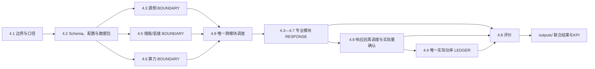

# 第四章 深远海能源岛源—储—算—用协同模型

> **检查入口。** 本文前半部分（4.1—4.10）是可用于项目报告的章节正文；文末“附录A—F”是
> V4工程检查索引，统一说明文件、模块、接口、仿真结果和验收之间的关系。正式联合运行只认
> `run_v4_integration.m`，跨模块调度只认4.9，公共物理总账只认4.4，综合评价只认4.8。

## 4.1 研究边界与统一口径

本章面向“蓝海枢纽”深远海能源岛，建立多源清洁能源、混合储能、海底绿色算力、
多形态产品交付之间的协同模型。系统在公共交流母线处耦合，以电力、氢气、算力服务和
海洋综合用能为价值出口，并通过统一调度协调各通道的功率分配。

模型采用MW、MWh、h、kg和kg/h作为公共单位。设备层可保留W、var和秒级计算，
但进入联合调度前必须转换为统一接口。所有模块均区分请求值、接受值和实际值，
母线平衡只采用最终实际值。

本章联合入口当前提供24 h、1 h步长的接口验证基线；4.5另设秒—分钟级构网降阶代理和
连续8760 h库存机制算例。未签认规模、负荷、初态和成本参数均为
**[假设值，待企业调研校准]**；未完成来源核验的专业代理公式均为
**[需查证文献支撑]**。

## 4.2 公共变量、接口与责任边界

联合模型采用`BLUE_HUB_CH4_SCHEMA_V2 / 2.0.0`。各模块的责任划分如下：

- 4.3负责风电、光伏和潮流能的源侧可用功率与实际出力；
- 4.5负责电池、电解槽和储氢的内部状态响应；
- 4.6负责数据中心功率、任务队列、SLA和算力服务量；
- 4.7负责电力、氢气、算力和海洋用能的交付通道；
- 4.9负责跨模块请求与功率分配；
- 4.4负责最终实际功率总账；
- 4.8负责经济、环境和可靠性评价。

其执行关系为：

```text
4.3/4.6发布边界
        ↓
4.9生成逐时功率与产品请求
        ↓
4.3—4.7返回专业模块实际响应
        ↓
4.9按实际响应确认弃电、缺供并必要时再调度
        ↓
4.4核验实际功率平衡
        ↓
4.8计算经济—环境—可靠性指标
```

4.4与4.9不可合并：前者是物理核账器，后者是调度协调器。4.8只评价，不得回写物理状态。

## 4.3 多元清洁能源供给模型

源侧由漂浮式风电、漂浮式光伏和潮流能组成。当前接口测试规模为40 MW，其中风电34 MW、
光伏4 MW、潮流能2 MW，对应85%、10%和5%的装机占比
**[假设值，待企业调研校准]**。波浪能作为后续扩展端口预留。

4.3分别计算各能源的可用功率、实际功率、辅机功率和集电损耗，再按照能量守恒原则将
5 min设备结果聚合为1 h公共功率。4.3只描述“能够提供多少能源”，不根据电价、氢价或
算力价格分配下游负荷。

当前24 h结果中，风电、光伏、潮流能分别提供550.108 MWh、27.314 MWh和19.457 MWh，
合计596.879 MWh。装机占比与发电量占比不同，不能据此直接判断容量组合最优。
上述数据来源类型为模型仿真结果，资源序列仍为合成基线。

## 4.4 公共母线实际功率平衡核算

公共母线是各模块交换电功率的唯一物理节点。跨模块分配请求由4.9产生，4.4在模块响应后
对实际量进行统一核账，其冻结关系为：

```text
源侧实际功率 + 电池放电 + 电网输入
= 电池充电 + 电解槽用电 + 数据中心用电 + 海缆外送
 + 海洋用能 + 源侧辅机 + 公共损耗 + 弃电
```

缺供是需求未满足量，不是物理电源，因此不得作为虚拟注入补齐平衡式。当前24 h最大母线
残差为1.038×10^-14 MW，说明现有接口在数值上闭合。该结果只证明守恒关系正确，
不证明调度策略已经最优。

## 4.5 构网型短时储能与长时氢储模型

4.5将电池和氢能链作为同一状态响应中枢。电池模型根据充放电请求、功率边界、效率和SOC
更新电量；氢能模型根据电解槽功率、单位制氢电耗、储罐空间和交付量更新产氢、水耗、
储氢损失与库存。

在联合模型中，4.5不自行决定电力分配，而是执行4.9请求，并先向4.7发布可交付氢量，
待4.7完成管道/船运交付后再提交期末库存。

默认24 h结果中电池充/放电量为27.242/24.586 MWh，电量由期初20 MWh回到期末20 MWh；
当期制氢570.220786 kg、损耗后交付564.518579 kg，期末储氢为0 kg。储氢初值为0 kg，
不再利用免费期初氢气形成收入。提氢请求按逐时库存递推，避免同一批累计库存跨时段
重复提取；4.8对其他场景净消耗的期初电池或储氢库存计入机会成本
**[假设值，待企业调研校准]**。

4.9现以4.5显式`BOUNDARY`接收期初状态、功率/能量边界和终端规则。电池循环/最低期末
规则与储氢循环/最低期末规则只约束模拟末点，不再误作全时段库存下限；可行场景自动修复
至期末目标，不可行请求触发硬错误。独立反例已验证系统允许周期内先放电、后回充，同时
禁止期末透支。

短时层已建立基于NREL/WECC REGFM_B1结构的秒—分钟级正序降阶代理，覆盖频率—有功、
电压—无功、正序限流、秒级SOC和黑启动带载顺序；它用于机制验证，不等同于工程级
EMT/HIL、故障保护或多机并联认证。长时层已完成连续8760 h库存递推和12×730 h窗口状态
继承，证明跨季节状态转移机制可运行；当前季节序列和储氢规模仍为
**[假设值，待企业/场址调研校准]**，尚不能视为真实场址容量结论。4.5独立验收共21项通过。

## 4.6 海底绿色算力高价值消纳模型

4.6把数据中心建模为具有刚性任务、可延期任务和可选任务的柔性负荷。模型根据4.9下发的
设施功率上限，计算IT功率、辅助功率、PUE、任务服务量、排队量、SLA违约和任务级收益。

算力服务量采用MWh-CS表示，当前由等效GPU功率归一化得到
**[假设值，待企业调研校准]**。4.6负责“生产多少算力服务”，不负责光缆交付；
电力输入只在4.4计入一次，4.6内部电费仅作为机会成本参考，4.8不重复计入源侧成本。

当前24 h数据中心设施用电98.828 MWh，形成85.275 MWh-CS算力服务，任务级毛收入为
444,582.59 CNY。价格来源为公开市场代理，不是项目合同价。

算力默认是可削减、可停机的柔性负荷；只有显式`computeFirmRequestMW`才构成电气刚性
边界。设施停机时功率可以为0，在线时条件最低功率约2.394 MW；当前单计算单元最大实际
功率约7.618 MW。4.2中120 MW为项目级接口上限 **[假设值，待企业调研校准]**，项目级
规模仍需建立多单元聚合。

## 4.7 多形态产品交付模型

4.7将各专业模块已经形成的能源或服务转换为可交付产品：

1. 电力产品：执行海缆送端容量、陆上接纳能力和输送损耗约束；
2. 氢气产品：接收4.5可交付库存，执行管道/船运能力与交付损耗；
3. 算力产品：接收4.6已完成服务量，执行光缆服务能力约束；
4. 海洋用能：处理淡化、海洋装备和岛上辅助等需求及未供量。

4.6与4.7的分界是“算力生产”和“算力交付”：PUE、任务队列和SLA只在4.6计算，
光缆交付上限和最终交付量只在4.7计算。4.7原始工程中保留的简化PUE、制氢库存、
综合平衡和目标函数仅用于历史原生测试，V4正式入口全部旁路。

默认结果形成85.275 MWh-CS算力交付、406.646 MWh海洋用能服务、42.323 MWh电力外送，
570.220786 kg当期制氢和564.518579 kg氢气交付，弃电为0。48 h压力场景另行形成
37,915.194822 kg当期制氢和37,156.890926 kg船运交付，并同时激活电力、算力与海洋用能。
4.7现分别输出管输/船运提取与交付量，
4.8分别计费；船期、船舶库存和航次能耗仍未建模。

## 4.8 经济—环境—可靠性评价

4.8只读取4.3—4.7提交的实际量，分别计算经济净成本、生命周期排放代理值和缺供电量。
源侧成本可按风电、光伏和潮流能分别计量；算力收益优先采用4.6任务级结果；海缆损耗、
算力内部电费、制氢成本和电池退化成本均按责任边界避免重复计算。

当前24 h接口测试的4.8目标向量为
`[7.46107×10^6 CNY, 9,776.84 kgCO2e, 25.3542 MWh]`。4.8已计入公开代理CAPEX、
3年建设期融资、固定运维、直线折旧、替换现值/年准备金，并输出25年NPV；同时保留期初
库存机会成本和分渠道运输成本。当前初始CAPEX为86.868亿元，含建设期融资CAPEX为
97.690亿元，含/不含惩罚NPV为-290.705/-140.070亿元。税费、残值、共享平台、换流站、
保险和多项替换规则仍未校准，24 h代表期重复年化亦为 **[假设值，待企业调研校准]**，
因此只能筛选候选方案，不能发布银行可融资NPV、税后IRR或正式回收期。

## 4.9 源—储—算—用协同调度

4.9是当前唯一跨模块协调入口。现行规则依次保障共同辅助负荷、显式算力刚性请求和海洋
刚性负荷，利用电池处理短时余缺，再安排柔性算力、合同制氢补产并按边际价值分配海缆与
制氢通道。4.6实际响应低于请求时，释放功率按“海洋未供需求→海缆剩余容量→同小时
直通制氢→弃电”重新分配，避免有可行消纳能力时同时弃电和缺供。

当前算法为`FEASIBILITY_RULE_V4_4_9`，属于确定性可行性规则，不提供全局最优性、
Pareto前沿或随机鲁棒性结论。现阶段还需补充：

- 电解槽启停、最小开停时间和爬坡约束；
- 4.6项目级多单元动态功率边界；
- 将当前顺序式释放功率再分配扩展为电池、算力、海缆和电解槽的迭代统一优化；
- 电力、氢气和算力的统一边际价值排序与正式优化；
- 日前—日内滚动时域、预测误差和故障场景；
- 8760 h容量—运行联合优化。

## 4.10 当前结论与后续验证

V4已经证明各专业模块能够通过统一接口完成24 h功率与产品流闭环，并避免4.6/4.7、
4.5/4.7、4.4/4.7和4.8/4.7之间的重复计算。4.5的21项独立断言还证明秒—分钟级
REGFM_B1降阶代理、黑启动顺序、期末硬约束和连续8760 h库存机制能够运行。但当前版本
尚未证明：

- 构网型短时储能通过工程级EMT/HIL、保护与多机并联验证；
- 氢储在真实场址连续年序列和具体储氢技术下具备季节经济可行性；
- 多形态价值转化在全寿命期内优于单一外送；
- 当前装机比例和调度顺序为经济最优策略。

48 h全通道压力场景已证明电力、当期制氢/船运、算力、海洋用能及饱和弃电能够按序激活，
且制氢37,915.194822 kg、船运交付37,156.890926 kg、弃电2,642.711291 MWh，最大母线
残差3.058×10^-13 MW；弃电与电气/海洋缺供并存时段为0。下一阶段应完成E/H/C/M方案
开关和168 h连续低出力场景，再扩展到真实场址8760 h资源序列和多目标优化。
只有在统一资源、统一初始/期末状态、统一可靠性约束和统一经济边界下，才能量化多形态
方案相对单一外送在消纳率、经济性、可靠性和环保性上的真实提升。

---

## 附录A V4文件关系总图

### A.1 唯一活动基线与权威顺序

`V4整合/`是第四章唯一活动基线。文件发生表述冲突时，按下列顺序判断：

1. `library/4.1边界与口径/`：研究边界、计量点和统一口径；
2. `library/4.2变量与接口/`：Schema、公共配置、数据包和校验规则；
3. `modules/4.3_source`—`modules/4.7_outputs`：专业物理模型及其实际响应；
4. `modules/4.9_dispatch/`：跨模块请求、再调度和可行性校验；
5. `modules/4.4_bus/`：最终实际功率总账；
6. `modules/4.8_objectives/`：状态提交后的经济—环境—可靠性评价；
7. 根目录审查文档：解释当前完成度和一致性，不反向改写上述模型。

旧研发树只在`90_历史工作归档/`中保存。需要追溯时先查
`历史文件索引.csv`或`历史资料索引.md`，不把历史文件重新当作V4活动代码。

### A.2 联合运行数据流



逐时调用关系为：

```text
common_config_4_2
  → v4_apply_4_5_parameter_overlay
  → v4_source_adapter + v4_compute_boundary_4_6
  → v4_storage_hydrogen_boundary_4_5
  → v4_dispatch_4_9
  → v4_compute_bridge.py
  → v4_redispatch_after_compute_4_9
  → v4_storage_hydrogen_response
  → v4_output_bridge.py
  → v4_finalize_4_5_packet
  → v4_reconcile_actuals_4_9
  → v4_bus_ledger
  → v4_evaluate_objectives_4_8
  → outputs/
```

### A.3 模块之间传递的核心对象

| 上游 | 下游 | 传递对象 | 边界解释 |
|---|---|---|---|
| 4.1/4.2 | 全部模块 | `cfg`、公共计量点、`common_packet` | 冻结单位、方向和字段语义 |
| 4.3 | 4.9、4.8 | 源侧可用/实际功率、逐源电量、辅机、集电损耗 | 4.3不决定下游用途 |
| 4.5 BOUNDARY | 4.9 | 电池/储氢初态、可充放边界、构网备用、终端规则 | 4.9不得从其他位置重置状态 |
| 4.9 REQUEST | 4.5/4.6/4.7 | 电池、电解槽、算力、海洋、外送和提氢请求 | 请求不等于实际量 |
| 4.6 RESPONSE | 4.9、4.7、4.8 | 设施/IT功率、服务量、队列、SLA、任务收益 | 4.7不重算PUE或任务 |
| 4.5 RESPONSE | 4.7、4.4、4.8 | 充放电、电解槽、产氢、可提氢量、状态 | 4.7按提取量扣库存、按交付量计产品 |
| 4.7 RESPONSE | 4.5、4.4、4.8 | 电/氢/算力交付、海洋服务、未供量 | 不建立第二套调度或总账 |
| 4.9 ACTUAL | 4.4、4.8 | 最终弃电、分类缺供、再调度记录 | 缺供不是母线虚拟注入 |
| 4.4 LEDGER | 4.8 | 实际功率残差、损耗和闭合状态 | 只核账，不决定优先级 |
| 4.8 EVALUATION | 报告/第5章 | 三目标原始向量和KPI | 只评价，不回写调度 |

## 附录B 根目录与公共层文件关系

### B.1 根目录文件

| 文件 | 类型 | 读取/调用关系 | 用途 |
|---|---|---|---|
| `README.md` | 总入口说明 | 首读 | 运行方式、边界和重要限制 |
| `run_v4_integration.m` | 唯一联合入口 | 调用4.2、4.3—4.9及Python桥 | 生成默认24 h联合结果 |
| `run_all_tests_v4.m` | 总验收入口 | 调用冻结Schema、各模块和48 h场景 | 12项顶层验收 |
| `build_v4_snapshot.ps1` | 包管理工具 | 读取`manifests/` | 刷新或核验包内相对路径、大小与SHA-256 |
| `V4第四章整体章节文案.md` | 正文＋工程索引 | 汇总全部活动模块 | 本文件，供章节审阅和文件关系检查 |
| `V4整合说明与验收清单.md` | 接口验收说明 | 引用联合测试结果 | 说明“接口通过”与“工程能力完成”的差别 |
| `V4模块任务完成度与去重审查.md` | 功能审查 | 对照4.3—4.9代码和结果 | 记录完成项、缺口和职责去重 |
| `V4文档代码图像一致性检查报告.md` | 交付一致性审查 | 对照代码、CSV、MAT、PNG、PDF | 记录文档—结果—图片是否匹配 |

已删除的`V4模块纳入与匹配检查报告.md`属于早期结构检查稿，其有效内容已经并入本附录和
`V4文档代码图像一致性检查报告.md`，避免顶层出现第四份含义相近的审查报告。

### B.2 4.1边界文件

| 文件 | 关系 |
|---|---|
| `library/4.1边界与口径/4.1系统边界与统一建模口径_V2.0_冻结版.md` | 第四章所有模型的文字边界和统一口径依据 |
| `library/4.1边界与口径/蓝海枢纽_4.1边界与口径冻结表_V1.0.docx` | 便于Word审阅的冻结表；不被代码读取 |

### B.3 4.2接口文件

| 文件/文件组 | 上下游关系 |
|---|---|
| `4.1-4.2公共标准冻结说明_V2.0.md` | 解释冻结版本与变更纪律 |
| `4.2第四章全量变量与接口字典_V2.0_冻结版.md` | 4.3—4.9字段、单位、方向和计量点字典 |
| `4.2算力接口语义增补_V2.0.md` | 补充4.6请求、实际功率和服务量语义 |
| `4.3-4.7去重与验收清单.md` | 冻结阶段的职责去重依据 |
| `common_config_4_2.m` | 创建`interface_smoke`公共配置，被联合入口首先调用 |
| `common_dispatch_port_4_2.m` | 创建请求/接受/实际功率端口 |
| `common_packet_4_2.m` | 创建4.3—4.9统一数据包 |
| `validate_common_schema_4_2.m` | 校验公共配置和Schema |
| `validate_module_packet_4_2.m` | 校验各模块数据包 |
| `demo_validate_common_schema_4_2.m` | 冻结Schema演示 |
| `run_all_tests_4_2.m` | 4.2自动验收，由V4总测试调用 |
| `4.2冻结标准验收结果_V2.mat`、`MATLAB校验报告.md` | 冻结验收留档，不参与运行 |
| `integration/common/v4_fill_port.m` | 各模块适配器共用的端口填充工具 |

## 附录C 4.3—4.9模块内部文件关系

### C.1 4.3多元供能

| 文件组 | 文件 | 关系 |
|---|---|---|
| 正式入口 | `integration/v4_source_adapter.m` | 调用风/光/潮设备模型和聚合函数，输出4.3 BOUNDARY/RESPONSE |
| 第5章源序列 | `integration/build_all_channel_source_scenario_4_3.m` | 复用正式24 h出力形状构造48 h机制压力场景 |
| 公开数据审计 | `integration/load_public_reference_resource_4_3.m` | 标准化NASA POWER/Open-Meteo等代理资源，不擅自补造潮流或轮毂风速 |
| 设备模型 | `model/wind/floating_wind_dispatch_v2.m`、`model/pv/floating_pv_dispatch_v2.m`、`model/tidal/tidal_current_dispatch_v2.m` | 形成设备级风、光、潮出力 |
| 聚合链 | `device_output_to_source_4_3_v3.m`、`source_aggregation_4_3_v3.m` | 设备输出转公共源端口并按能量守恒聚合 |
| 分析函数 | `compare_source_portfolios_4_3_v3.m`、`source_complementarity_metrics_v3.m`、`evaluate_scenario_coverage_4_3_v3.m`、`source_state_dictionary_4_3_v3.m`、`validate_joint_scenarios_4_3_v3.m` | 只做组合、互补性、覆盖和状态检查，不参与4.9功率分配 |
| 独立演示支持 | `model/demo_support/bus_balance_4_4_v3.m`、`marine_source_hub_v3.m` | 只服务4.3演示；不得替代正式4.4/4.9 |
| 演示 | `demos/demo_public_baseline_v2.m`、`demo_version3_4_3.m`、`demo_portfolio_comparison_4_3_v3.m`、`demo_public_resource_audit_4_3.m` | 分别展示基线、V3、组合比较和公开数据审计 |
| 测试 | `tests/run_all_tests_4_3_v3.m` | 4.3六项原生验收，由V4总测试调用 |
| 文档 | `README.md`、`docs/4.3公开数据替代与证据清单.md`、`4.3多能源供给模型完整报告_V3.md`、`V4代码取舍与来源说明.md`、`Version3修改与验收说明.md`、`参数可识别性清单.md`、`多能源互补体系_v2.3_4.3.md`、`海洋能源岛源侧模型_v2.md` | 依次说明入口、数据证据、完整报告、版本取舍、验收、待辨识参数、聚合体系和设备建模 |
| 图像 | `docs/assets/figure_4_3_*.png`共6幅 | V3合成数据说明图，不等同于40 MW联合结果图 |

4.3的正式运行链只使用设备模型、聚合链和`v4_source_adapter.m`；演示支持函数虽含局部平衡，
但输出不会进入联合包，因此与4.4不存在运行期重复。

### C.2 4.4公共母线

| 文件组 | 文件 | 关系 |
|---|---|---|
| 唯一正式入口 | `integration/v4_bus_ledger.m` | 接收4.3、4.5、4.6、4.7最终`actual`和4.9确认量，计算唯一总账 |
| 现行说明 | `docs/4.4公共母线功率平衡说明.md` | 解释冻结平衡式、损耗边界和24 h结果 |
| 报告生成 | `docs/build_current_report.py` | 读取根`outputs/v4_hourly_summary.csv`和目标汇总，生成现行图片/PDF |
| 交付图文 | `docs/assets/figure_4_4_v4_hourly_balance.png`、`报告.pdf` | 对应当前联合CSV，不是早期参考场景 |
| 追溯模型 | `reference_model/main.py`、`test_plots.py`、`core/*.py`、`scenarios/*.py`、`visualization/*.py` | 原4.4设备/备用/场景方程快照，仅供追溯，不进入联合路径 |

`reference_model/`不是第二个活动总账。若只检查当前结果，应查看
`v4_bus_ledger.m`、`v4_hourly_summary.csv`、现行PNG和PDF。

### C.3 4.5短时储能—制氢—长时储氢

| 文件组 | 文件 | 关系 |
|---|---|---|
| 参数叠加 | `integration/v4_apply_4_5_parameter_overlay.m` | 在冻结4.2配置上增加4.5显式参数，不改Schema |
| 边界发布 | `v4_storage_hydrogen_boundary_4_5.m` | 向4.9发布初态、功率/能量边界、备用和终端规则 |
| 专业响应 | `v4_storage_hydrogen_response.m` | 将4.9请求送入唯一小时物理核心 |
| 状态提交 | `v4_finalize_4_5_packet.m` | 结合4.7实际提氢量形成最终4.5 RESPONSE |
| 小时物理核心 | `model/v4_storage_hydrogen_core_4_5.m` | 电池SOC、模块化电解槽、产氢、水耗、储氢和终端检查 |
| 构网参数/动态 | `v4_gfm_parameters_4_5.m`、`v4_gfm_regfm_b1_dynamic_4_5.m` | 秒—分钟级REGFM_B1正序降阶代理 |
| 长周期库存 | `v4_seasonal_hydrogen_storage_4_5.m` | 连续8760 h与跨窗口状态继承 |
| 独立验收 | `run_4_5_standalone_validation.m`、`tests/run_all_tests_4_5.m` | 生成多时标输出并执行21项断言 |
| 现行输出 | `outputs/multiscale_validation/4_5_*.csv`、`.mat`、`.png` | 72 h、秒级、黑启动代理和8760 h结果 |
| 文档 | `README.md`、`docs/4.5公开数据替代与接口审查.md`、`4.5多时标接口语义增补_V4.md`、`电能制氢建模.md` | 入口、证据、接口语义和方法说明 |
| 文档资产 | `docs/assets/blue_hub_*.csv`、`fig01`—`fig11` | `fig07`为当前多时标总览，`fig08`—`fig11`为按时标分开的当前过程图；`fig01`—`fig06`是独立方法算例资产，不能当作联合结果 |
| 追溯模型 | `reference_model/blue_hub_demo_and_figures.m`、DOCX、XLSX | 早期24 h MILP方法算例和原始附件，不进入联合路径 |

4.5与4.7的质量关系是“4.5发布可交付量→4.7执行通道提取→4.5按实际提取提交库存”；
4.5与4.9的状态关系是“4.5发布显式BOUNDARY→4.9只读该状态并生成请求”。

### C.4 4.6绿色算力

| 文件组 | 文件 | 关系 |
|---|---|---|
| 边界适配 | `integration/v4_compute_boundary_4_6.m` | 在运行前发布算力设施可行功率范围 |
| 响应桥 | `integration/v4_compute_bridge.py` | 接收4.9逐时请求并调用DC-only模型 |
| SLA模型 | `DC_model_v2_1/src/udc_dc_only/model.py` | 计算任务、队列、SLA、功率和收益 |
| 功率跟随模型 | `raw_model.py` | 仅用于全通道压力场景的无限任务池吸纳上界 |
| 公共内部函数 | `config.py`、`data_loader.py`、`pue.py`、`reporting.py`、`__init__.py` | 配置、数据加载、PUE和结果输出 |
| 运行脚本 | `scripts/run_model.py`、`run_raw_model.py`、`check_data.py`、`plot_results.py`及两个`.bat` | 独立运行、数据检查和绘图；联合入口直接调用Python桥 |
| 配置 | `config/default.json`、`power_shortage_test.json`、`raw_power_following.json` | 默认、缺电和功率跟随场景 |
| 实际读取数据 | `UDC_data/01_Workload/*.csv`、`02_IT_System/it_system_parameters.csv`、`03_Cooling_PUE/*`、`04_Economics_Interface/*.csv` | 任务、IT、海温/冷却和经济接口数据 |
| 测试 | `tests/test_smoke.py` | Python模型冒烟测试 |
| 文档 | 模块`README.md`、`integration/README.md`、`DC_model_v2_1/README.md`、`CURRENT_UDC_DATA_CHECK.md`、`DATA_UPDATE_GUIDE.md`、`docs/4.6绿色算力负荷模型与V4集成说明.md`、`4.6公开数据替代与市场校准清单.md` | 分别说明责任、桥接、模型、数据状态、更新方法、接口与市场校准 |

4.6生产算力服务，4.7只交付服务。4.6内部电价为业务机会成本参考；4.8不得再次把同一设施
用电作为外购电成本重复计入。

### C.5 4.7多形态交付

| 文件组 | 文件 | 关系 |
|---|---|---|
| 唯一正式入口 | `integration/v4_output_bridge.py` | 只调用电力外送与海洋用能函数，并接收4.5氢气和4.6算力成品 |
| 正式调用核心 | `delivery_model/src/bluehub_submodules/power_export.py`、`marine_load.py` | 分别处理海缆容量/损耗和海洋需求/未供 |
| 原生独立工程 | `delivery_model`其余源码、配置、示例、测试、`pyproject.toml`和`uv.lock` | 不进入V4联合入口；用于原模型测试和方程追溯 |
| 文档 | 模块`README.md`、`delivery_model/README.md`、`目标函数与约束条件.md`、`docs/工程使用说明.md` | 前者说明V4边界，后三者说明原生独立工程 |

原生独立工程中的`compute_load.py`、`hydrogen_output.py`、`balance.py`、`objectives.py`和
`scenario.py`与4.6、4.5、4.4/4.9、4.8存在功能重叠，但V4正式桥已旁路它们。
这些文件目前仅因“原方程可追溯”保留，不得被新入口调用；其历史原件也可通过
`90_历史工作归档/历史文件索引.csv`定位。

### C.6 4.8综合评价

| 文件 | 关系 |
|---|---|
| `model/v4_objective_parameters_4_8.m` | 集中保存公开情景锚点与未签认系数 |
| `v4_evaluate_objectives_4_8.m` | 读取4.3—4.7实际量和4.9标识，生成三目标原始向量/KPI |
| `v4_validate_evaluation_4_8.m` | 独立校验评价包 |
| `v4_public_generation_cost_benchmarks_4_8.m` | 保存风、光、潮公开成本参考点及不可比声明 |
| `v4_levelized_source_cost_4_8.m` | 仅在边界统一后计算逐源LCOE |
| `README.md`、`docs/4.8多目标评价说明.md` | 说明现行评价边界 |
| `docs/08_4.8-4.9目标架构.md` | 早期目标架构依据；现行实现以4.8/4.9代码和各自README为准 |

4.8中的风、光、潮成本必须分源比较，但不能把不同币值年、不同海域、不同系统边界的公开
数字直接排序。当前只有同口径参数全部校准后，才可形成供能组合的正式最优策略。

### C.7 4.9协同调度

| 文件 | 关系 |
|---|---|
| `model/v4_dispatch_4_9.m` | 读取4.3/4.5/4.6 BOUNDARY并生成逐时请求 |
| `v4_redispatch_after_compute_4_9.m` | 4.6少用电时按海洋→海缆→直通制氢→弃电再分配 |
| `v4_reconcile_actuals_4_9.m` | 按专业模块实际响应确认弃电和分类缺供 |
| `v4_validate_dispatch_4_9.m` | 独立复算电池/储氢路径并检查容量、守恒和终端约束 |
| `test_v4_dispatch_scenarios_4_9.m` | 额定制氢、饱和弃电和新能源骤降测试 |
| `test_v4_post_compute_redispatch_4_9.m` | 算力释放后再调度专项测试 |
| `test_v4_terminal_path_rules_4_9.m` | 期末规则和4.5 BOUNDARY隔离测试 |
| `README.md`、`docs/4.9调度与求解说明.md` | 算法、边界和未完成能力说明 |

4.9当前是确定性可行协调器`FEASIBILITY_RULE_V4_4_9`。文件名中的“dispatch”不得被解释为已经完成多目标最优调度、随机优化或滚动时域优化。

## 附录D 输出、图像与第5章准备文件关系

### D.1 默认24 h输出

| 输出文件 | 由谁生成 | 被谁读取/检查 |
|---|---|---|
| `outputs/v4_integration_result.mat` | `run_v4_integration.m` | 深度复核全部4.3—4.9包和最终状态 |
| `v4_hourly_summary.csv` | 同上 | 4.4报告、时序图和数值核对 |
| `v4_hourly_detail.csv` | 同上 | 4.3—4.9统一时轴全过程图和跨模块审计 |
| `v4_objective_summary.csv` | 同上 | 4.8目标摘要和报告 |
| `v4_kpi_summary.csv` | 同上 | 最终指标汇总图与第5章指标表 |
| `v4_economic_breakdown.csv` | 同上 | 成本/收入分项图及总额恒等式校验 |
| `v4_environment_breakdown.csv` | 同上 | 生命周期排放代理分项图及总额恒等式校验 |
| `v4_compute_request.csv`、`v4_compute_response.csv` | 联合入口与4.6桥 | 审计请求—实际功率差 |
| `v4_output_request.csv`、`v4_output_response.csv` | 联合入口与4.7桥 | 审计产品请求—交付结果 |
| `v4_compute_audit.json` | 4.6桥 | 记录数据回退和模型模式 |
| `test_compute_sla.csv`、`test_compute_power_following.csv` | 顶层/场景测试 | 算力两种模式专项检查 |
| `v4_test_report.mat` | `run_all_tests_v4.m` | 12项顶层验收留档 |

### D.2 48 h全通道输出

`outputs/chapter5_all_channel_48h/`中的`v4_*`文件与默认输出同构，但属于48 h压力场景；
`all_channel_summary.csv`汇总通道激活结果，`all_channel_validation_report.csv`保存13项行为
断言。两类输出不得混用。

默认24 h和48 h场景均在各自`figures/final_kpi/`中保存最终指标图，在
`figures/timeseries/`中保存完整周期变化图。时序图按源侧供能、功率分配、电池、氢、
算力、产品交付、响应后再调度和母线残差分开，避免多模块、多量纲挤在一张图上。

### D.3 第5章准备目录

| 文件 | 关系 |
|---|---|
| `chapter5_preparation/run_all_channel_validation_v4.m` | 调用同一联合入口，构造48 h全通道机制场景 |
| `run_chapter5_readiness_audit.m` | 检查E/H/C/M四方案所需字段和场景是否就绪 |
| `chapter5_readiness_report.csv` | 就绪度审计输出 |
| `render_v4_results.py` | 读取统一KPI、分项和逐时底稿，生成最终指标图与全过程图 |
| `render_validation_figures.py` | 同时调用上述渲染器处理默认24 h和48 h场景 |
| `assets/figure_ch5_all_channel_48h.png` | 对应48 h压力场景 |
| `第5章典型场景验证与四方案对比准备.md` | 说明经济性、弃电率、碳减排和稳定性比较尚需补齐的统一口径 |

### D.4 当前数值基准

| 场景 | 关键结果 | 数据来源类型 |
|---|---|---|
| 24 h `interface_smoke` | 源侧596.879 MWh；产氢570.221 kg；氢交付564.519 kg；外送42.323 MWh；算力设施98.828 MWh；海洋未供25.354 MWh；弃电约0；最大残差1.038×10^-14 MW | **[模型仿真结果]** |
| 48 h全通道压力场景 | 制氢37,915.195 kg；船运交付37,156.891 kg；弃电2,642.711 MWh；最大残差3.058×10^-13 MW | **[模型仿真结果]** |
| 4.5独立8760 h机制场景 | 峰值库存2,123.345 t；连续释放4,378 h；期末0 | **[模型仿真结果]** |

上述场景容量、资源序列、控制参数和未签认价格仍为
**[假设值，待企业调研校准]**，只用于机制与接口验收。

## 附录E 清单、测试与可追溯关系

### E.1 manifests目录

| 文件 | 作用 |
|---|---|
| `v4_package_manifest.csv` | 当前可移植V4包内相对路径、大小和SHA-256；`-VerifyOnly`的唯一输入 |
| `v4_modules_curated_manifest.csv` | 模块择优纳入文件明细 |
| `v4_modules_curated_summary.csv` | 各模块纳入数量和大小摘要 |
| `v4_module_compatibility.csv` | 模块与冻结接口兼容性记录 |
| `v4_snapshot_manifest.csv` | 开发源快照逐文件哈希 |
| `v4_snapshot_scope.csv` | 开发源与V4快照目录映射 |
| `v4_snapshot_summary.csv` | 开发源快照统计摘要 |

普通检查只运行：

```powershell
powershell -ExecutionPolicy Bypass -File .\build_v4_snapshot.ps1 -VerifyOnly
```

只修改V4自有文档、图片或适配器后，先运行
`-RefreshPackageManifestOnly`，再运行`-VerifyOnly`。不要在普通文档修改后执行无参数开发
重建，否则可能从历史源重新覆盖参考快照。

### E.2 测试层级

| 层级 | 入口 | 证明什么 | 不证明什么 |
|---|---|---|---|
| 4.2冻结测试 | `run_all_tests_4_2.m` | Schema与公共端口一致 | 专业模型正确性 |
| 4.3原生测试 | `run_all_tests_4_3_v3.m` | 源侧设备与聚合链 | 真实场址资源有效性 |
| 4.5独立测试 | `run_all_tests_4_5.m` | 小时、秒级代理和8760 h库存机制 | EMT/HIL、真实季节经济性 |
| 4.9专项测试 | 三个`test_v4_*.m` | 请求、再调度、路径和终端约束 | 全局最优性 |
| 联合验收 | `run_all_tests_v4.m` | 4.1—4.9接口、总账、去重和48 h机制闭环 | 工程容量与商业承诺 |
| 包校验 | `build_v4_snapshot.ps1 -VerifyOnly` | 文件未缺失、未被静默改写 | 数学模型一定正确 |

## 附录F 冗余处置与人工检查清单

### F.1 本轮结构清理

- 删除`tmp/`中的PDF渲染中间件；正式PDF仍保留在`modules/4.4_bus/报告.pdf`；
- 删除4.6、4.7生成的全部`__pycache__/`和`.pyc`，运行时可自动再生成，不属于成果；
- 删除已被新审查体系覆盖的`V4模块纳入与匹配检查报告.md`，其有效结构信息已并入本文；
- 保留4.4、4.5和4.7的`reference_model/`或原生独立工程，因为其仍承担方程来源追溯；
  它们与正式运行链通过目录和入口隔离，不属于运行期重复计算；
- 保留4.5输出图和文档资产图的发布副本：前者是可复算输出，后者保证文档独立打开时图片
  可用，二者内容相同但交付职责不同。

### F.2 建议的检查顺序

1. 先读根`README.md`和本文4.1—4.10，确认项目表述；
2. 按附录A检查4.9调度、4.4总账、4.8评价是否仍保持单一职责；
3. 按附录C逐模块检查“正式入口”，不要先进入`reference_model/`；
4. 用`outputs/v4_hourly_summary.csv`核对4.3—4.7逐时实际量；
5. 用`v4_integration_result.mat`核对状态、BOUNDARY、REQUEST、RESPONSE和EVALUATION包；
6. 检查4.4 PNG/PDF、4.5多时标图、48 h全通道图是否对应各自CSV；
7. 运行`run_all_tests_v4()`，再运行包内`-VerifyOnly`；
8. 审阅经济结论时同时打开4.8全生命周期说明和第5章准备文档，避免把短周期年化NPV
   当作可融资NPV、LCOE、LCOH或方案最优结论。

### F.3 当前仍需补齐

- 真实场址连续8760 h风、光、潮资源及相关性；
- 4.6项目级多计算单元聚合和可校准任务—GPU映射；
- 电解槽最小开停时间、部分负荷SEC、共享BOP和退化；
- 船期、船舶库存、压缩/液化能耗与航次成本；
- E/H/C/M四方案统一开关、统一初末状态，以及按方案启用资产的CAPEX/O&M和全寿命现金流；
- 多目标优化、滚动时域、预测误差、故障场景与工程级EMT/HIL。

在这些数据和模型补齐前，所有未签认工程参数继续标注
**[假设值，待企业调研校准]**；无法核验来源的专业公式继续标注
**[需查证文献支撑]**。
